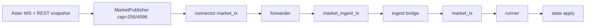

# Connectivity Mapping + Scorecard

## Meta
- commit_sha: `2580a1b5c8439926bc5053fbc1ae90e343818619` (`git rev-parse HEAD`)
- generated_utc: `2026-02-21T17:47:33Z` (`date -u +"%Y-%m-%dT%H:%M:%SZ"`)
- branch: `docs/connectivity-mapping-scorecard` (`git status --short --branch`)
- commands used for anchors/evidence:
  - `nl -ba paraphina/src/live/connectors/{extended,hyperliquid,lighter,aster,paradex}.rs | sed -n ...`
  - `nl -ba paraphina/src/live/{market_publisher.rs,runner.rs,state_cache.rs,shared_venue_ages.rs,venue_health.rs}`
  - `nl -ba paraphina/src/{state.rs,telemetry.rs}`
  - `nl -ba paraphina/src/bin/paraphina_live.rs | sed -n ...`
  - `nl -ba tools/ws_soak_report.py | sed -n ...`
  - `nl -ba .github/workflows/ws_shadow_soak.yml | sed -n ...`
  - `gh run download <run_id> --name ws_shadow_soak_<run_id> --dir ./artifacts/<run_id>`
  - `nl -ba artifacts/<run_id>/ws_shadow_soak_<run_id>/{ws_soak_report.md,ws_soak_report.stdout,telemetry.jsonl}`
  - `jq -r '.venue_depth_near_mid_usd[0] // empty' artifacts/<run_id>/ws_shadow_soak_<run_id>/telemetry.jsonl | awk ...`

## Shared segment (all five venues)
- Connector market events flow through: connector-local `market_tx(1024)` -> forwarder (`spawn_connector_forwarders`) -> `market_ingest_tx(1024)` -> ingest bridge -> `market_tx(1024)` -> runner drain/order/coalesce -> `cache.apply_market_event` -> `apply_market_event_to_core`. (`paraphina/src/bin/paraphina_live.rs:941-960`, `paraphina/src/bin/paraphina_live.rs:1746-1771`, `paraphina/src/bin/paraphina_live.rs:1808-1827`, `paraphina/src/bin/paraphina_live.rs:2922-2930`, `paraphina/src/live/runner.rs:1326-1360`, `paraphina/src/live/runner.rs:1409-1440`, `paraphina/src/live/runner.rs:2568-2643`)
- Forwarders rewrite `venue_id`/`venue_index` before ingest; ingest bridge can override event timestamps only in paper mode (`PARAPHINA_PAPER_USE_WALLCLOCK_TS`). (`paraphina/src/bin/paraphina_live.rs:843-868`, `paraphina/src/bin/paraphina_live.rs:1755-1762`)
- Runner can defer future-dated events (`event_ts_ms > now_ms`) and re-queue them, so connector timestamps directly affect apply timing. (`paraphina/src/live/runner.rs:1340-1351`)
- `age_event_ms` is derived from `last_mid_update_ms` (event timestamp lineage), while `age_ms` uses `last_mid_apply_ms` (local apply-time lineage). (`paraphina/src/telemetry.rs:1641-1661`, `paraphina/src/state.rs:296-347`, `paraphina/src/live/runner.rs:2580-2613`)

---

## Venue Map: extended

### Contract (IN/OUT)
- IN: public WS orderbook stream (`depth=1` by default, full depth when `PARAPHINA_EXTENDED_WS_DEPTH_LEVELS>1`) plus REST snapshot bootstrap and REST funding polling. (`paraphina/src/live/connectors/extended.rs:200-219`, `paraphina/src/live/connectors/extended.rs:401-457`, `paraphina/src/live/connectors/extended.rs:370-391`)
- OUT: `MarketDataEvent::{L2Snapshot,L2Delta,FundingUpdate}` published via `MarketPublisher` to connector `market_tx`, then shared forwarder/ingest/runner path. (`paraphina/src/live/connectors/extended.rs:263-277`, `paraphina/src/live/connectors/extended.rs:1622-1630`, `paraphina/src/live/connectors/extended.rs:1831-1840`, `paraphina/src/live/connectors/extended.rs:1855-1861`, `paraphina/src/live/connectors/extended.rs:379-383`, `paraphina/src/bin/paraphina_live.rs:941-960`, `paraphina/src/bin/paraphina_live.rs:1746-1771`, `paraphina/src/live/runner.rs:1361-1450`)

### Queue/backpressure surfaces
- Connector publisher queue is `256` live / `4096` fixture, drain batch `64`. (`paraphina/src/live/connectors/extended.rs:15-17`, `paraphina/src/live/connectors/extended.rs:252-266`)
- Lossless policy is only `L2Snapshot`/`L2Delta`; non-lossless events (for extended: funding) go through `try_send` and may become latest-wins `pending_latest`. (`paraphina/src/live/connectors/extended.rs:268-273`, `paraphina/src/live/market_publisher.rs:311-352`)
- Shared backpressure surfaces: connector `market_tx(1024)`, ingest `market_ingest_tx(1024)`, and runner coalescing/cap path (`PARAPHINA_L2_TICK_DELTA_BUFFER_MAX`, `cap_hits`). (`paraphina/src/bin/paraphina_live.rs:1746-1749`, `paraphina/src/bin/paraphina_live.rs:1808-1810`, `paraphina/src/live/runner.rs:558-636`, `paraphina/src/live/runner.rs:1099-1103`, `paraphina/src/live/runner.rs:1271-1302`)

### Timestamp semantics
- REST bootstrap snapshot uses local `now_ms()`. (`paraphina/src/live/connectors/extended.rs:448-456`)
- WS snapshot parser uses payload `E/ts` with fallback to local `now_ms()`. (`paraphina/src/live/connectors/extended.rs:1815-1821`, `paraphina/src/live/connectors/extended.rs:1831-1840`)
- Delta events from seq-state use exchange event time when present, else local fallback. (`paraphina/src/live/connectors/extended.rs:1571-1574`, `paraphina/src/live/connectors/extended.rs:1622-1627`)
- Funding uses `time|timestamp|ts` then fallback `now_ms()`. (`paraphina/src/live/connectors/extended.rs:1512-1518`, `paraphina/src/live/connectors/extended.rs:1526-1533`)
- Impact on ages: event timestamp writes `last_mid_update_ms`; runner writes `last_mid_apply_ms` on successful L2 apply (or all extended L2 when `PARAPHINA_EXTENDED_APPLY_AGE_ON_ANY_L2=1`); telemetry exports both. (`paraphina/src/state.rs:317-343`, `paraphina/src/live/runner.rs:1038-1040`, `paraphina/src/live/runner.rs:2591-2613`, `paraphina/src/telemetry.rs:1641-1661`)
- Future timestamp deferral is active for all venues including extended. (`paraphina/src/live/runner.rs:1340-1351`)

### Reconnect taxonomy
- Defined/emitted reasons: `session_timeout`, `stale_watchdog`, `ping_send_fail`, `read_timeout`, `parse_error`, `seq_gap`, `seq_mismatch`. (`paraphina/src/live/connectors/extended.rs:334-335`, `paraphina/src/live/connectors/extended.rs:606-607`, `paraphina/src/live/connectors/extended.rs:612-613`, `paraphina/src/live/connectors/extended.rs:625-626`, `paraphina/src/live/connectors/extended.rs:814-816`, `paraphina/src/live/connectors/extended.rs:810-813`, `paraphina/src/live/connectors/extended.rs:1005-1010`)
- Watchdog anchor is `max(last_book_event_ns,last_published_ns)`; this explicitly detects WS-alive-but-no-book-data cases. (`paraphina/src/live/connectors/extended.rs:81-85`, `paraphina/src/live/connectors/extended.rs:96-107`)
- Ping and read-timeout are explicit reconnect triggers. (`paraphina/src/live/connectors/extended.rs:495-502`, `paraphina/src/live/connectors/extended.rs:610-619`, `paraphina/src/live/connectors/extended.rs:624-635`)

### Observability index
- WS_AUDIT emitters in segment:
  - `reconnect_reason=*` (`extended_audit_reconnect`). (`paraphina/src/live/connectors/extended.rs:52-67`)
  - `component=ws_msg` periodic counters (frames, parse/publish counters, age facets). (`paraphina/src/live/connectors/extended.rs:541-595`)
  - `extended_read_timeout_ms=*` one-shot config emit. (`paraphina/src/live/connectors/extended.rs:471-475`)
  - `component=market_publisher` periodic queue/counter audit (shared publisher). (`paraphina/src/live/market_publisher.rs:153-175`)
  - `component=runner_apply` (extended apply/event age and cache/apply counters). (`paraphina/src/live/runner.rs:1712-1749`)
- `ws_soak_report` parse/report coverage:
  - Parses reconnect, market_publisher counters, runner_apply, extended `ws_msg`, extended read-timeout config. (`tools/ws_soak_report.py:374-377`, `tools/ws_soak_report.py:495-515`, `tools/ws_soak_report.py:563-580`)
  - Reports dedicated sections for reconnect, market_publisher, runner_apply, extended ws_msg, extended read-timeout. (`tools/ws_soak_report.py:867-1076`)
  - Gate-affecting: age/plateau, reconnect reasons in `{stale_watchdog,read_timeout,ping_send_fail,session_timeout}`, market_publisher `mp_*` counters, runner `cap_hits`. (`tools/ws_soak_report.py:27-45`, `tools/ws_soak_report.py:706-789`)
  - Not gate-affecting: extended `ws_msg` and `extended_read_timeout_ms` diagnostics. (`tools/ws_soak_report.py:1023-1076`, `tools/ws_soak_report.py:706-789`)

### Config knobs
- Connector env knobs with defaults/effects: `PARAPHINA_EXTENDED_STALE_MS`, `PARAPHINA_EXTENDED_WS_READ_TIMEOUT_MS`, `PARAPHINA_EXTENDED_PING_INTERVAL_MS`, `PARAPHINA_EXTENDED_WS_DEPTH_LEVELS`. (`paraphina/src/live/connectors/extended.rs:12-15`, `paraphina/src/live/connectors/extended.rs:28-41`, `paraphina/src/live/connectors/extended.rs:496-500`, `paraphina/src/live/connectors/extended.rs:201-219`)
- Workflow wiring: `extended_ws_read_timeout_ms`, `extended_ws_depth_levels`, and `PARAPHINA_EXTENDED_APPLY_AGE_ON_ANY_L2` dispatch env export. (`.github/workflows/ws_shadow_soak.yml:20-44`, `.github/workflows/ws_shadow_soak.yml:66-67`, `.github/workflows/ws_shadow_soak.yml:90-119`)

### Mermaid diagram


### Evidence index (dedup)
- `paraphina/src/live/connectors/extended.rs:12-17`
- `paraphina/src/live/connectors/extended.rs:28-41`
- `paraphina/src/live/connectors/extended.rs:52-67`
- `paraphina/src/live/connectors/extended.rs:81-107`
- `paraphina/src/live/connectors/extended.rs:200-219`
- `paraphina/src/live/connectors/extended.rs:252-277`
- `paraphina/src/live/connectors/extended.rs:334-335`
- `paraphina/src/live/connectors/extended.rs:370-391`
- `paraphina/src/live/connectors/extended.rs:401-457`
- `paraphina/src/live/connectors/extended.rs:471-475`
- `paraphina/src/live/connectors/extended.rs:495-502`
- `paraphina/src/live/connectors/extended.rs:541-635`
- `paraphina/src/live/connectors/extended.rs:805-818`
- `paraphina/src/live/connectors/extended.rs:1000-1013`
- `paraphina/src/live/connectors/extended.rs:1475-1538`
- `paraphina/src/live/connectors/extended.rs:1571-1630`
- `paraphina/src/live/connectors/extended.rs:1815-1861`
- `paraphina/src/bin/paraphina_live.rs:941-960`
- `paraphina/src/bin/paraphina_live.rs:1746-1771`
- `paraphina/src/live/market_publisher.rs:153-175`
- `paraphina/src/live/market_publisher.rs:311-352`
- `paraphina/src/live/runner.rs:1038-1040`
- `paraphina/src/live/runner.rs:1099-1103`
- `paraphina/src/live/runner.rs:1271-1302`
- `paraphina/src/live/runner.rs:1340-1351`
- `paraphina/src/live/runner.rs:1712-1749`
- `paraphina/src/live/runner.rs:2591-2613`
- `paraphina/src/state.rs:317-343`
- `paraphina/src/telemetry.rs:1641-1661`
- `tools/ws_soak_report.py:27-45`
- `tools/ws_soak_report.py:374-377`
- `tools/ws_soak_report.py:495-515`
- `tools/ws_soak_report.py:563-580`
- `tools/ws_soak_report.py:706-789`
- `tools/ws_soak_report.py:867-1076`
- `.github/workflows/ws_shadow_soak.yml:20-44`
- `.github/workflows/ws_shadow_soak.yml:66-67`
- `.github/workflows/ws_shadow_soak.yml:90-119`

---

## Venue Map: hyperliquid

### Contract (IN/OUT)
- IN: WS `l2Book` subscribe (`coin`, `nSigFigs`, `nLevels`) with optional REST snapshot refresh/fallback and REST funding polling. (`paraphina/src/live/connectors/hyperliquid.rs:557-565`, `paraphina/src/live/connectors/hyperliquid.rs:1232-1247`, `paraphina/src/live/connectors/hyperliquid.rs:1139-1205`, `paraphina/src/live/connectors/hyperliquid.rs:1207-1229`)
- OUT: `MarketDataEvent::{L2Snapshot,L2Delta,FundingUpdate}` through connector-internal queue then connector `market_tx` to shared path. (`paraphina/src/live/connectors/hyperliquid.rs:606-625`, `paraphina/src/live/connectors/hyperliquid.rs:690-760`, `paraphina/src/live/connectors/hyperliquid.rs:1498-1541`, `paraphina/src/live/connectors/hyperliquid.rs:1217-1221`, `paraphina/src/bin/paraphina_live.rs:941-960`)

### Queue/backpressure surfaces
- Internal publish queue `HL_INTERNAL_PUB_Q=256`; send path is `try_send`, with `pending_latest` overwrite on full (latest-wins, lossy). (`paraphina/src/live/connectors/hyperliquid.rs:13-13`, `paraphina/src/live/connectors/hyperliquid.rs:606-607`, `paraphina/src/live/connectors/hyperliquid.rs:690-760`)
- Forwarder task drains queue and collapses multiple queued events to latest (`while try_recv`) and then applies pending-latest replacement. (`paraphina/src/live/connectors/hyperliquid.rs:611-618`)
- Shared channel and runner coalescing/cap surfaces apply after connector `market_tx`. (`paraphina/src/bin/paraphina_live.rs:1746-1749`, `paraphina/src/live/runner.rs:558-636`)

### Timestamp semantics
- WS L2 parser timestamps from `data.time` with `0` fallback. (`paraphina/src/live/connectors/hyperliquid.rs:1513-1537`)
- Resilient snapshot decode and REST snapshot fetch both default timestamp to `0` if absent. (`paraphina/src/live/connectors/hyperliquid.rs:1931-1945`, `paraphina/src/live/connectors/hyperliquid.rs:1985-2002`)
- Seq gaps (`msg.seq > prev+1`) trigger snapshot refresh marker, not immediate connector reconnect. (`paraphina/src/live/connectors/hyperliquid.rs:1473-1489`)
- Funding timestamp uses response `time` else local `now_ms`. (`paraphina/src/live/connectors/hyperliquid.rs:2069-2079`, `paraphina/src/live/connectors/hyperliquid.rs:2119-2124`)
- Runner age semantics and future-event deferral are shared (apply vs event age split). (`paraphina/src/live/runner.rs:1340-1351`, `paraphina/src/live/runner.rs:2580-2613`, `paraphina/src/telemetry.rs:1641-1661`)

### Reconnect taxonomy
- Defined/emitted reasons: `session_timeout`, `stale_watchdog`, `ping_send_fail`, `read_timeout`. (`paraphina/src/live/connectors/hyperliquid.rs:497-498`, `paraphina/src/live/connectors/hyperliquid.rs:780-781`, `paraphina/src/live/connectors/hyperliquid.rs:787-788`, `paraphina/src/live/connectors/hyperliquid.rs:797-798`)
- Ping/read-timeout are explicit periodic watchdog controls. (`paraphina/src/live/connectors/hyperliquid.rs:575-582`, `paraphina/src/live/connectors/hyperliquid.rs:792-802`)

### Observability index
- WS_AUDIT emitters in segment:
  - `reconnect_reason=*` (`hl_audit_reconnect`). (`paraphina/src/live/connectors/hyperliquid.rs:69-85`)
  - `component=hl_pubq` periodic queue/pressure/timestamp-zero counters. (`paraphina/src/live/connectors/hyperliquid.rs:626-680`)
- `ws_soak_report` parse/report coverage:
  - Parses reconnect and `hl_pubq` fields; reports reconnect + HL PubQ sections. (`tools/ws_soak_report.py:374-377`, `tools/ws_soak_report.py:547-562`, `tools/ws_soak_report.py:867-893`, `tools/ws_soak_report.py:984-1021`)
  - Gate-affecting reconnect reasons are only `{stale_watchdog,read_timeout,ping_send_fail,session_timeout}` with threshold max 3. (`tools/ws_soak_report.py:35-41`, `tools/ws_soak_report.py:745-755`)
  - HL pubq metrics are reported but not gate-failing fields. (`tools/ws_soak_report.py:984-1021`, `tools/ws_soak_report.py:706-789`)

### Config knobs
- Connector knobs: `PARAPHINA_HL_STALE_MS`, `PARAPHINA_HL_WS_CONNECT_TIMEOUT_MS`, `PARAPHINA_HL_WS_READ_TIMEOUT_MS`, `PARAPHINA_HL_PING_INTERVAL_MS`, `HL_L2_LEVELS`, `HL_L2_SIGFIGS`. (`paraphina/src/live/connectors/hyperliquid.rs:10-25`, `paraphina/src/live/connectors/hyperliquid.rs:36-58`, `paraphina/src/live/connectors/hyperliquid.rs:262-269`, `paraphina/src/live/connectors/hyperliquid.rs:575-579`)
- Workflow wiring: `hl_l2_levels` input exported as `HL_L2_LEVELS`. (`.github/workflows/ws_shadow_soak.yml:36-39`, `.github/workflows/ws_shadow_soak.yml:67-67`, `.github/workflows/ws_shadow_soak.yml:99-99`)

### Mermaid diagram


### Evidence index (dedup)
- `paraphina/src/live/connectors/hyperliquid.rs:10-25`
- `paraphina/src/live/connectors/hyperliquid.rs:36-58`
- `paraphina/src/live/connectors/hyperliquid.rs:69-85`
- `paraphina/src/live/connectors/hyperliquid.rs:262-269`
- `paraphina/src/live/connectors/hyperliquid.rs:497-498`
- `paraphina/src/live/connectors/hyperliquid.rs:557-565`
- `paraphina/src/live/connectors/hyperliquid.rs:575-582`
- `paraphina/src/live/connectors/hyperliquid.rs:606-760`
- `paraphina/src/live/connectors/hyperliquid.rs:780-802`
- `paraphina/src/live/connectors/hyperliquid.rs:1139-1205`
- `paraphina/src/live/connectors/hyperliquid.rs:1207-1229`
- `paraphina/src/live/connectors/hyperliquid.rs:1232-1247`
- `paraphina/src/live/connectors/hyperliquid.rs:1473-1541`
- `paraphina/src/live/connectors/hyperliquid.rs:1931-1945`
- `paraphina/src/live/connectors/hyperliquid.rs:1985-2002`
- `paraphina/src/live/connectors/hyperliquid.rs:2069-2131`
- `paraphina/src/bin/paraphina_live.rs:941-960`
- `paraphina/src/bin/paraphina_live.rs:1746-1749`
- `paraphina/src/live/runner.rs:558-636`
- `paraphina/src/live/runner.rs:1340-1351`
- `paraphina/src/live/runner.rs:2580-2613`
- `paraphina/src/telemetry.rs:1641-1661`
- `tools/ws_soak_report.py:35-41`
- `tools/ws_soak_report.py:374-377`
- `tools/ws_soak_report.py:547-562`
- `tools/ws_soak_report.py:706-789`
- `tools/ws_soak_report.py:867-893`
- `tools/ws_soak_report.py:984-1021`
- `.github/workflows/ws_shadow_soak.yml:36-39`
- `.github/workflows/ws_shadow_soak.yml:67-67`
- `.github/workflows/ws_shadow_soak.yml:99-99`

---

## Venue Map: lighter

### Contract (IN/OUT)
- IN: public WS `order_book/<market_id>` stream (plus optional read-only URL mutation), and REST funding polling. (`paraphina/src/live/connectors/lighter.rs:70-85`, `paraphina/src/live/connectors/lighter.rs:714-719`, `paraphina/src/live/connectors/lighter.rs:1075-1123`)
- OUT: `MarketDataEvent::{L2Snapshot,L2Delta,FundingUpdate}` via `MarketPublisher` to connector `market_tx`, then shared forwarder/runner path. (`paraphina/src/live/connectors/lighter.rs:366-380`, `paraphina/src/live/connectors/lighter.rs:1323-1350`, `paraphina/src/live/connectors/lighter.rs:1415-1453`, `paraphina/src/live/connectors/lighter.rs:1517-1529`, `paraphina/src/live/connectors/lighter.rs:1576-1587`, `paraphina/src/live/connectors/lighter.rs:1110-1113`, `paraphina/src/bin/paraphina_live.rs:941-960`)

### Queue/backpressure surfaces
- Publisher queue cap `256`, drain max `64`. (`paraphina/src/live/connectors/lighter.rs:8-9`, `paraphina/src/live/connectors/lighter.rs:366-369`)
- Lossless events are only `L2Snapshot`/`L2Delta`; non-lossless events (funding) can hit `try_send` + `pending_latest` latest-wins behavior under pressure. (`paraphina/src/live/connectors/lighter.rs:371-375`, `paraphina/src/live/market_publisher.rs:311-352`)
- Additional reconnect-guard on repeated delta decode failure forces fresh snapshot recovery after 10 consecutive failures. (`paraphina/src/live/connectors/lighter.rs:16-18`, `paraphina/src/live/connectors/lighter.rs:994-1003`)

### Timestamp semantics
- `decode_market_timestamp_ms` reads `timestamp|ts`; if missing/non-positive, uses local nonzero fallback and increments `lighter_ts_fallback_count`. (`paraphina/src/live/connectors/lighter.rs:306-330`)
- L2 snapshot/delta decoders all consume the same timestamp decoder. (`paraphina/src/live/connectors/lighter.rs:1321-1322`, `paraphina/src/live/connectors/lighter.rs:1441-1442`, `paraphina/src/live/connectors/lighter.rs:1516-1517`, `paraphina/src/live/connectors/lighter.rs:1576-1577`)
- Funding timestamps use `timestamp|ts` with local fallback. (`paraphina/src/live/connectors/lighter.rs:3320-3338`)
- Runner/telemetry age split and future-event defer apply as shared behavior. (`paraphina/src/live/runner.rs:1340-1351`, `paraphina/src/live/runner.rs:2580-2613`, `paraphina/src/telemetry.rs:1641-1661`)

### Reconnect taxonomy
- Defined/emitted reasons: `subscribe_error`, `session_timeout`, `stale_watchdog`, `ping_send_fail`, `read_timeout`, `decode_fail_loop`. (`paraphina/src/live/connectors/lighter.rs:604-605`, `paraphina/src/live/connectors/lighter.rs:629-630`, `paraphina/src/live/connectors/lighter.rs:748-749`, `paraphina/src/live/connectors/lighter.rs:765-766`, `paraphina/src/live/connectors/lighter.rs:782-783`, `paraphina/src/live/connectors/lighter.rs:997-998`)
- Ping and read-timeout are explicit reconnect controls; ping counters are emitted for success/failure. (`paraphina/src/live/connectors/lighter.rs:738-775`, `paraphina/src/live/connectors/lighter.rs:778-787`)

### Observability index
- WS_AUDIT emitters in segment:
  - `reconnect_reason=*`. (`paraphina/src/live/connectors/lighter.rs:288-303`)
  - `lighter_ping_sent_count`, `lighter_ping_send_fail_count`. (`paraphina/src/live/connectors/lighter.rs:755-770`)
  - `lighter_ts_fallback_count` with context/raw/fallback timestamp. (`paraphina/src/live/connectors/lighter.rs:317-326`)
  - `component=market_publisher` (shared). (`paraphina/src/live/market_publisher.rs:153-175`)
- `ws_soak_report` parse/report coverage:
  - Parses lighter reconnects, ping counters, and timestamp fallback stats; reports both sections. (`tools/ws_soak_report.py:374-377`, `tools/ws_soak_report.py:581-607`, `tools/ws_soak_report.py:593-607`, `tools/ws_soak_report.py:1078-1130`)
  - Gate-affecting remains reconnect subset + market_publisher counters + cap_hits; ping/fallback diagnostics are report-only. (`tools/ws_soak_report.py:35-45`, `tools/ws_soak_report.py:706-789`)

### Config knobs
- Connector knobs: `PARAPHINA_LIGHTER_STALE_MS`, `PARAPHINA_LIGHTER_WS_CONNECT_TIMEOUT_MS`, `PARAPHINA_LIGHTER_WS_READ_TIMEOUT_MS`, `PARAPHINA_LIGHTER_PING_INTERVAL_MS`, `PARAPHINA_LIGHTER_WS_READONLY`. (`paraphina/src/live/connectors/lighter.rs:32-62`, `paraphina/src/live/connectors/lighter.rs:70-75`)
- Workflow wiring: `lighter_ping_interval_ms` input exported to `PARAPHINA_LIGHTER_PING_INTERVAL_MS`; read-only mode forced in soak workflow. (`.github/workflows/ws_shadow_soak.yml:16-19`, `.github/workflows/ws_shadow_soak.yml:89-89`, `.github/workflows/ws_shadow_soak.yml:114-116`)

### Mermaid diagram


### Evidence index (dedup)
- `paraphina/src/live/connectors/lighter.rs:8-18`
- `paraphina/src/live/connectors/lighter.rs:32-75`
- `paraphina/src/live/connectors/lighter.rs:288-330`
- `paraphina/src/live/connectors/lighter.rs:366-380`
- `paraphina/src/live/connectors/lighter.rs:604-630`
- `paraphina/src/live/connectors/lighter.rs:738-787`
- `paraphina/src/live/connectors/lighter.rs:879-880`
- `paraphina/src/live/connectors/lighter.rs:994-1003`
- `paraphina/src/live/connectors/lighter.rs:1075-1123`
- `paraphina/src/live/connectors/lighter.rs:1321-1350`
- `paraphina/src/live/connectors/lighter.rs:1415-1453`
- `paraphina/src/live/connectors/lighter.rs:1516-1529`
- `paraphina/src/live/connectors/lighter.rs:1576-1587`
- `paraphina/src/live/connectors/lighter.rs:3320-3338`
- `paraphina/src/bin/paraphina_live.rs:941-960`
- `paraphina/src/live/market_publisher.rs:153-175`
- `paraphina/src/live/market_publisher.rs:311-352`
- `paraphina/src/live/runner.rs:1340-1351`
- `paraphina/src/live/runner.rs:2580-2613`
- `paraphina/src/telemetry.rs:1641-1661`
- `tools/ws_soak_report.py:35-45`
- `tools/ws_soak_report.py:374-377`
- `tools/ws_soak_report.py:581-607`
- `tools/ws_soak_report.py:706-789`
- `tools/ws_soak_report.py:1078-1130`
- `.github/workflows/ws_shadow_soak.yml:16-19`
- `.github/workflows/ws_shadow_soak.yml:89-89`
- `.github/workflows/ws_shadow_soak.yml:114-116`

---

## Venue Map: aster

### Contract (IN/OUT)
- IN: WS `<symbol>@depth@100ms` stream, REST snapshot bootstrap/resync, and REST funding polling. (`paraphina/src/live/connectors/aster.rs:375-377`, `paraphina/src/live/connectors/aster.rs:393-401`, `paraphina/src/live/connectors/aster.rs:963-980`, `paraphina/src/live/connectors/aster.rs:346-367`)
- OUT: `MarketDataEvent::{L2Snapshot,L2Delta,FundingUpdate}` via `MarketPublisher` to connector `market_tx`, then shared path. (`paraphina/src/live/connectors/aster.rs:235-249`, `paraphina/src/live/connectors/aster.rs:500-508`, `paraphina/src/live/connectors/aster.rs:1548-1553`, `paraphina/src/live/connectors/aster.rs:357-358`, `paraphina/src/bin/paraphina_live.rs:941-960`)

### Queue/backpressure surfaces
- Publisher queue cap `256` live / `4096` fixture, drain max `64`. (`paraphina/src/live/connectors/aster.rs:48-50`, `paraphina/src/live/connectors/aster.rs:223-238`)
- Lossless policy covers `L2Snapshot`/`L2Delta`; non-lossless (funding) follows shared try-send path if pressured. (`paraphina/src/live/connectors/aster.rs:240-244`, `paraphina/src/live/market_publisher.rs:311-352`)
- Internal buffered delta list before snapshot bridge has cap `1024`; overflow forces resync fetch. (`paraphina/src/live/connectors/aster.rs:386-388`, `paraphina/src/live/connectors/aster.rs:740-747`)

### Timestamp semantics
- Snapshot publish path stamps `timestamp_ms=now_ms()`. (`paraphina/src/live/connectors/aster.rs:500-506`)
- Delta events use WS event time `E` when present, else local `now_ms()`. (`paraphina/src/live/connectors/aster.rs:1639-1643`, `paraphina/src/live/connectors/aster.rs:1492-1493`, `paraphina/src/live/connectors/aster.rs:1552-1553`)
- Funding timestamps use `time|timestamp|ts` fallback to `now_ms()`. (`paraphina/src/live/connectors/aster.rs:1379-1385`, `paraphina/src/live/connectors/aster.rs:1390-1396`)
- Shared runner age/apply semantics and future defer apply unchanged. (`paraphina/src/live/runner.rs:1340-1351`, `paraphina/src/live/runner.rs:2580-2613`, `paraphina/src/telemetry.rs:1641-1661`)

### Reconnect taxonomy
- Defined/emitted reasons: `session_timeout`, `stale_watchdog`, `seq_gap`, `ping_send_fail`, `read_timeout`. (`paraphina/src/live/connectors/aster.rs:310-311`, `paraphina/src/live/connectors/aster.rs:454-455`, `paraphina/src/live/connectors/aster.rs:556-557`, `paraphina/src/live/connectors/aster.rs:764-765`, `paraphina/src/live/connectors/aster.rs:774-775`)
- `seq_gap` trigger sites include buffered-drain bridge path and steady-state WS delta paths. (`paraphina/src/live/connectors/aster.rs:555-566`, `paraphina/src/live/connectors/aster.rs:723-735`, `paraphina/src/live/connectors/aster.rs:835-850`, `paraphina/src/live/connectors/aster.rs:899-914`)

### Observability index
- WS_AUDIT emitters in segment:
  - `reconnect_reason=*` only from connector-level Aster audit. (`paraphina/src/live/connectors/aster.rs:94-109`)
  - `component=market_publisher` from shared publisher layer. (`paraphina/src/live/market_publisher.rs:153-175`)
- `ws_soak_report` parse/report/gate:
  - Parses reconnect and market_publisher counters (and common age/gate sources). (`tools/ws_soak_report.py:374-377`, `tools/ws_soak_report.py:495-502`, `tools/ws_soak_report.py:706-789`)
  - Reports reconnect + market_publisher sections. (`tools/ws_soak_report.py:867-902`)
  - No Aster-specific connector custom fields are parsed separately beyond reconnect. (`tools/ws_soak_report.py:547-622`, `tools/ws_soak_report.py:581-622`)

### Config knobs
- Connector knobs: `PARAPHINA_ASTER_STALE_MS`, `PARAPHINA_ASTER_PING_INTERVAL_MS`, plus standard endpoint/market env (`ASTER_WS_URL`, `ASTER_REST_URL`, `ASTER_MARKET`, `ASTER_DEPTH_LIMIT`). (`paraphina/src/live/connectors/aster.rs:61-67`, `paraphina/src/live/connectors/aster.rs:159-169`, `paraphina/src/live/connectors/aster.rs:412-418`)
- Workflow wiring: no explicit Aster-only knob in `ws_shadow_soak.yml`; it runs via connector list and common envs. (`.github/workflows/ws_shadow_soak.yml:50-54`, `.github/workflows/ws_shadow_soak.yml:107-123`)

### Mermaid diagram


### Evidence index (dedup)
- `paraphina/src/live/connectors/aster.rs:45-50`
- `paraphina/src/live/connectors/aster.rs:61-67`
- `paraphina/src/live/connectors/aster.rs:94-109`
- `paraphina/src/live/connectors/aster.rs:159-169`
- `paraphina/src/live/connectors/aster.rs:223-249`
- `paraphina/src/live/connectors/aster.rs:310-311`
- `paraphina/src/live/connectors/aster.rs:346-367`
- `paraphina/src/live/connectors/aster.rs:375-377`
- `paraphina/src/live/connectors/aster.rs:386-388`
- `paraphina/src/live/connectors/aster.rs:412-418`
- `paraphina/src/live/connectors/aster.rs:454-456`
- `paraphina/src/live/connectors/aster.rs:500-508`
- `paraphina/src/live/connectors/aster.rs:555-566`
- `paraphina/src/live/connectors/aster.rs:723-735`
- `paraphina/src/live/connectors/aster.rs:759-775`
- `paraphina/src/live/connectors/aster.rs:835-850`
- `paraphina/src/live/connectors/aster.rs:899-914`
- `paraphina/src/live/connectors/aster.rs:963-980`
- `paraphina/src/live/connectors/aster.rs:1379-1404`
- `paraphina/src/live/connectors/aster.rs:1492-1495`
- `paraphina/src/live/connectors/aster.rs:1548-1553`
- `paraphina/src/live/connectors/aster.rs:1639-1643`
- `paraphina/src/bin/paraphina_live.rs:941-960`
- `paraphina/src/live/market_publisher.rs:153-175`
- `paraphina/src/live/market_publisher.rs:311-352`
- `paraphina/src/live/runner.rs:1340-1351`
- `paraphina/src/live/runner.rs:2580-2613`
- `paraphina/src/telemetry.rs:1641-1661`
- `tools/ws_soak_report.py:374-377`
- `tools/ws_soak_report.py:495-502`
- `tools/ws_soak_report.py:547-622`
- `tools/ws_soak_report.py:706-789`
- `tools/ws_soak_report.py:867-902`
- `.github/workflows/ws_shadow_soak.yml:50-54`
- `.github/workflows/ws_shadow_soak.yml:107-123`

---

## Venue Map: paradex

### Contract (IN/OUT)
- IN: public WS with feed mode switch `PARAPHINA_PARADEX_PUBLIC_FEED` (`bbo` default vs `orderbook`) plus REST funding polling. (`paraphina/src/live/connectors/paradex.rs:364-386`, `paraphina/src/live/connectors/paradex.rs:329-349`)
- OUT: `MarketDataEvent::{L2Snapshot,L2Delta,FundingUpdate}` via `MarketPublisher` to connector `market_tx`, then shared path. (`paraphina/src/live/connectors/paradex.rs:210-224`, `paraphina/src/live/connectors/paradex.rs:556-585`, `paraphina/src/live/connectors/paradex.rs:893-940`, `paraphina/src/live/connectors/paradex.rs:339-340`, `paraphina/src/bin/paraphina_live.rs:941-960`)
- Event variants by feed mode:
  - `bbo` mode emits top-of-book `L2Snapshot` only from `decode_bbo_top_and_snapshot`. (`paraphina/src/live/connectors/paradex.rs:586-590`, `paraphina/src/live/connectors/paradex.rs:1474-1533`)
  - `orderbook` mode parses structured/legacy order-book messages and may emit `L2Snapshot` or `L2Delta` through `ParadexSeqState::apply`. (`paraphina/src/live/connectors/paradex.rs:1254-1293`, `paraphina/src/live/connectors/paradex.rs:1295-1361`, `paraphina/src/live/connectors/paradex.rs:893-940`)

### Queue/backpressure surfaces
- Publisher queue cap `256`, drain max `64`; lossless policy is L2-only (`L2Snapshot`/`L2Delta`). (`paraphina/src/live/connectors/paradex.rs:14-15`, `paraphina/src/live/connectors/paradex.rs:210-219`)
- Non-lossless events (funding) use shared `try_send` + `pending_latest` latest-wins under pressure. (`paraphina/src/live/connectors/paradex.rs:339-340`, `paraphina/src/live/market_publisher.rs:311-352`)
- Shared channel/backpressure surfaces and runner cap/coalescing apply after connector publish. (`paraphina/src/bin/paraphina_live.rs:1746-1749`, `paraphina/src/live/runner.rs:558-636`)

### Timestamp semantics
- `bbo` snapshots use local `now_ms()`. (`paraphina/src/live/connectors/paradex.rs:1513-1529`)
- Structured order-book parser timestamps snapshots and deltas with local `now_ms()`, and structured deltas set `prev_seq=None`. (`paraphina/src/live/connectors/paradex.rs:1307-1327`, `paraphina/src/live/connectors/paradex.rs:1353-1358`)
- Legacy snapshot uses `ts|timestamp` fallback `now_ms`; legacy delta uses local `now_ms`. (`paraphina/src/live/connectors/paradex.rs:1401-1407`, `paraphina/src/live/connectors/paradex.rs:1432-1439`)
- Funding timestamp extraction tries `timestamp|ts|time|created_at`, then local fallback. (`paraphina/src/live/connectors/paradex.rs:1168-1175`, `paraphina/src/live/connectors/paradex.rs:1187-1193`)
- Shared runner impact: `age_event_ms` tracks these connector timestamps, while `age_ms` tracks local apply; future-dated events defer. (`paraphina/src/live/runner.rs:1340-1351`, `paraphina/src/live/runner.rs:2580-2613`, `paraphina/src/telemetry.rs:1641-1661`)

### Reconnect taxonomy
- Defined reason strings in connector: `session_timeout`, `stale_watchdog`, `ping_send_fail`, `read_timeout`, `subscribe_error`, `seq_gap`, `seq_mismatch`, `parse_error`. (`paraphina/src/live/connectors/paradex.rs:293-294`, `paraphina/src/live/connectors/paradex.rs:436-437`, `paraphina/src/live/connectors/paradex.rs:453-454`, `paraphina/src/live/connectors/paradex.rs:471-472`, `paraphina/src/live/connectors/paradex.rs:544-545`, `paraphina/src/live/connectors/paradex.rs:614-619`)

### Defined vs emittable nuance (Paradex)
- `seq_gap` is defined/classified in reconnect mapping by checking `err.to_string().contains("seq gap")`. (`paraphina/src/live/connectors/paradex.rs:609-620`)
- Current seq-state error producer emits `"paradex seq mismatch ..."` (not `"seq gap"`) when `prev_seq` check fails. (`paraphina/src/live/connectors/paradex.rs:913-919`)
- Structured order-book deltas force `prev_seq=None`, which bypasses mismatch branch and further reduces `"seq gap"` text generation in current paths. (`paraphina/src/live/connectors/paradex.rs:1353-1357`, `paraphina/src/live/connectors/paradex.rs:913-920`)
- Only other `seq_gap` occurrence is test naming, not runtime error text. (`paraphina/src/live/connectors/paradex.rs:1980-2000`, `paraphina/src/live/connectors/paradex.rs:613-614`)
- Classification: `seq_gap` is currently dormant/unobserved unless a future error path emits literal `"seq gap"` text. (`paraphina/src/live/connectors/paradex.rs:609-620`, `paraphina/src/live/connectors/paradex.rs:913-919`, `paraphina/src/live/connectors/paradex.rs:1353-1357`, `paraphina/src/live/connectors/paradex.rs:1980-2000`)

### Observability index
- WS_AUDIT emitters in segment:
  - `reconnect_reason=*`. (`paraphina/src/live/connectors/paradex.rs:43-58`)
  - `paradex_ping_sent_count`, `paradex_ping_send_fail_count`. (`paraphina/src/live/connectors/paradex.rs:443-459`)
  - `component=market_publisher` (shared publisher layer). (`paraphina/src/live/market_publisher.rs:153-175`)
- `ws_soak_report` parse/report coverage:
  - Parses reconnect and paradex ping counters; reports reconnect + ping sections. (`tools/ws_soak_report.py:374-377`, `tools/ws_soak_report.py:608-621`, `tools/ws_soak_report.py:867-894`, `tools/ws_soak_report.py:1078-1099`)
  - Gate-affecting reconnect reasons are only `{stale_watchdog,read_timeout,ping_send_fail,session_timeout}`; `seq_gap/seq_mismatch/parse_error/subscribe_error` are report-only if observed. (`tools/ws_soak_report.py:35-41`, `tools/ws_soak_report.py:745-755`)
  - Ping counters are diagnostic/report-only (not gate checks). (`tools/ws_soak_report.py:1078-1099`, `tools/ws_soak_report.py:706-789`)

### Config knobs
- Connector knobs: `PARAPHINA_PARADEX_STALE_MS`, `PARAPHINA_PARADEX_PING_INTERVAL_MS`, `PARAPHINA_PARADEX_PUBLIC_FEED`, and standard endpoint envs (`PARADEX_WS_URL`, `PARADEX_REST_URL`, `PARADEX_MARKET`). (`paraphina/src/live/connectors/paradex.rs:28-33`, `paraphina/src/live/connectors/paradex.rs:142-170`, `paraphina/src/live/connectors/paradex.rs:364-367`, `paraphina/src/live/connectors/paradex.rs:397-401`)
- Workflow wiring: dispatch input `paradex_public_feed` default `bbo`, exported to `PARAPHINA_PARADEX_PUBLIC_FEED`. (`.github/workflows/ws_shadow_soak.yml:24-31`, `.github/workflows/ws_shadow_soak.yml:91-118`)

### Mermaid diagram
```mermaid
flowchart LR
  X[Paradex WS (bbo/orderbook)] --> MP[MarketPublisher cap=256]
  MP --> CMTX[connector market_tx]
  CMTX --> FWD[forwarder]
  FWD --> ING[market_ingest_tx]
  ING --> BR[ingest bridge]
  BR --> MTX[market_tx]
  MTX --> RUN[runner]
  RUN --> APPLY[state apply]
```

### Evidence index (dedup)
- `paraphina/src/live/connectors/paradex.rs:12-21`
- `paraphina/src/live/connectors/paradex.rs:28-33`
- `paraphina/src/live/connectors/paradex.rs:43-58`
- `paraphina/src/live/connectors/paradex.rs:142-170`
- `paraphina/src/live/connectors/paradex.rs:210-224`
- `paraphina/src/live/connectors/paradex.rs:293-294`
- `paraphina/src/live/connectors/paradex.rs:329-349`
- `paraphina/src/live/connectors/paradex.rs:364-401`
- `paraphina/src/live/connectors/paradex.rs:436-477`
- `paraphina/src/live/connectors/paradex.rs:544-549`
- `paraphina/src/live/connectors/paradex.rs:556-585`
- `paraphina/src/live/connectors/paradex.rs:609-620`
- `paraphina/src/live/connectors/paradex.rs:893-940`
- `paraphina/src/live/connectors/paradex.rs:1091-1201`
- `paraphina/src/live/connectors/paradex.rs:1254-1361`
- `paraphina/src/live/connectors/paradex.rs:1401-1443`
- `paraphina/src/live/connectors/paradex.rs:1474-1533`
- `paraphina/src/live/connectors/paradex.rs:1980-2000`
- `paraphina/src/bin/paraphina_live.rs:941-960`
- `paraphina/src/bin/paraphina_live.rs:1746-1749`
- `paraphina/src/live/market_publisher.rs:153-175`
- `paraphina/src/live/market_publisher.rs:311-352`
- `paraphina/src/live/runner.rs:558-636`
- `paraphina/src/live/runner.rs:1340-1351`
- `paraphina/src/live/runner.rs:2580-2613`
- `paraphina/src/telemetry.rs:1641-1661`
- `tools/ws_soak_report.py:35-41`
- `tools/ws_soak_report.py:374-377`
- `tools/ws_soak_report.py:608-621`
- `tools/ws_soak_report.py:706-789`
- `tools/ws_soak_report.py:867-894`
- `tools/ws_soak_report.py:1078-1099`
- `.github/workflows/ws_shadow_soak.yml:24-31`
- `.github/workflows/ws_shadow_soak.yml:91-118`

---

## Connectivity Scorecard

### Methodology
- Cross-venue rankings in sections 1-4 are computed from a single baseline run: `22257576977` (post-fix run with all five venues reported in one table). (GitHub Actions run `22257576977`, artifact `ws_shadow_soak_22257576977/ws_soak_report.md`, lines `10-16`)
- Runs `22247716334` and `22249042793` are historical/supporting baselines and are not mixed into the baseline ranking itself. (GitHub Actions run `22247716334`, artifact `ws_shadow_soak_22247716334/ws_soak_report.md`, lines `10-16`; GitHub Actions run `22249042793`, artifact `ws_shadow_soak_22249042793/ws_soak_report.md`, lines `10-16`)

### Evidence basis
- Baseline run: GitHub Actions run `22257576977`, artifact `ws_shadow_soak_22257576977/ws_soak_report.md`, lines `4-77`; artifact `ws_shadow_soak_22257576977/ws_soak_report.stdout`, lines `94-95`.
- Historical baseline A: GitHub Actions run `22247716334`, artifact `ws_shadow_soak_22247716334/ws_soak_report.md`, lines `4-77`; artifact `ws_shadow_soak_22247716334/ws_soak_report.stdout`, lines `94-95`.
- Historical baseline B: GitHub Actions run `22249042793`, artifact `ws_shadow_soak_22249042793/ws_soak_report.md`, lines `4-77`; artifact `ws_shadow_soak_22249042793/ws_soak_report.stdout`, lines `94-95`.

### How to reproduce evidence from CI runs
1. Download artifacts:
```bash
gh run download 22257576977 --name ws_shadow_soak_22257576977 --dir ./artifacts/22257576977
gh run download 22247716334 --name ws_shadow_soak_22247716334 --dir ./artifacts/22247716334
gh run download 22249042793 --name ws_shadow_soak_22249042793 --dir ./artifacts/22249042793
```
2. Inspect cited lines:
```bash
nl -ba artifacts/22257576977/ws_shadow_soak_22257576977/ws_soak_report.md | sed -n '10,77p'
nl -ba artifacts/22257576977/ws_shadow_soak_22257576977/ws_soak_report.stdout | sed -n '94,95p'
```
3. Recompute extended depth-zero summary from telemetry:
```bash
for run in 22247716334 22249042793 22257576977; do
  file=artifacts/$run/ws_shadow_soak_$run/telemetry.jsonl
  jq -r '.venue_depth_near_mid_usd[0] // empty' "$file" | \
    awk -v run=$run 'BEGIN{n=0;z=0;cur=0;max=0} {n++; if($1==0){z++; cur++; if(cur>max)max=cur}else{cur=0}} END{printf("run=%s zero_ticks=%d total_ticks=%d zero_pct=%.2f max_zero_streak=%d\n", run,z,n,100*z/n,max)}'
done
```

### 1) Staleness/nonhealthy-time drivers (ranked)
- Baseline ranking metric is `apply_p95` (with `apply_p99` as tie-break). (GitHub Actions run `22257576977`, artifact `ws_shadow_soak_22257576977/ws_soak_report.md`, lines `10-16`)
- Rank 1: `aster` and `lighter` (`apply_p95=0.0ms`, `apply_p99=250.0ms`). (GitHub Actions run `22257576977`, artifact `ws_shadow_soak_22257576977/ws_soak_report.md`, lines `12-16`)
- Rank 2: `paradex` (`apply_p95=251.0ms`, `apply_p99=750.0ms`). (GitHub Actions run `22257576977`, artifact `ws_shadow_soak_22257576977/ws_soak_report.md`, lines `16-16`)
- Rank 3: `hyperliquid` (`apply_p95=501.0ms`, `apply_p99=750.0ms`). (GitHub Actions run `22257576977`, artifact `ws_shadow_soak_22257576977/ws_soak_report.md`, lines `14-14`)
- Rank 4: `extended` (`apply_p95=1500.0ms`, `apply_p99=2750.0ms`). (GitHub Actions run `22257576977`, artifact `ws_shadow_soak_22257576977/ws_soak_report.md`, lines `13-13`)
- Driver semantics: status staleness is keyed from apply-age (`last_mid_apply_ms`), while event-age is separate telemetry; disable is from dev/api breaches in health manager. (`paraphina/src/telemetry.rs:1641-1655`, `paraphina/src/live/venue_health.rs:78-100`)

### 2) Reconnect churn by reason (ranked)
- Baseline rank 1 tie (all venues): no reconnect evidence observed. (GitHub Actions run `22257576977`, artifact `ws_shadow_soak_22257576977/ws_soak_report.md`, lines `18-19`)
- Baseline gate status: `GATE: PASS`. (GitHub Actions run `22257576977`, artifact `ws_shadow_soak_22257576977/ws_soak_report.stdout`, lines `95-95`)
- Historical support: both baseline runs also show no reconnect evidence and `GATE: PASS`. (GitHub Actions run `22247716334`, artifact `ws_shadow_soak_22247716334/ws_soak_report.md`, lines `18-19`; artifact `ws_shadow_soak_22247716334/ws_soak_report.stdout`, lines `95-95`; GitHub Actions run `22249042793`, artifact `ws_shadow_soak_22249042793/ws_soak_report.md`, lines `18-19`; artifact `ws_shadow_soak_22249042793/ws_soak_report.stdout`, lines `95-95`)

### 3) Backpressure indicators (ranked)
- Baseline rank 1 tie: `aster`, `extended`, `lighter`, `paradex` show zero market-publisher pressure counters and zero runner `cap_hits`. (GitHub Actions run `22257576977`, artifact `ws_shadow_soak_22257576977/ws_soak_report.md`, lines `21-25`; artifact `ws_shadow_soak_22257576977/ws_soak_report.md`, lines `70-77`)
- Baseline rank 2: `hyperliquid` reports nonzero queue occupancy (`max_queued_hiwater=2`, `max_queued_len=1`) but still zero overflow/overwrite counters (`max_try_send_full=0`, `max_pending_overwrite=0`). (GitHub Actions run `22257576977`, artifact `ws_shadow_soak_22257576977/ws_soak_report.md`, lines `44-47`)
- Historical support: hyperliquid shows the same no-overflow pattern in both historical runs. (GitHub Actions run `22247716334`, artifact `ws_shadow_soak_22247716334/ws_soak_report.md`, lines `44-47`; GitHub Actions run `22249042793`, artifact `ws_shadow_soak_22249042793/ws_soak_report.md`, lines `44-47`)

### 4) Timestamp fallback pressure (ranked)
- Baseline rank 1 (higher observed fallback activity): `lighter` (`max_lighter_ts_fallback_count=1`). (GitHub Actions run `22257576977`, artifact `ws_shadow_soak_22257576977/ws_soak_report.md`, lines `65-68`)
- Rank 2 tie (`extended`, `hyperliquid`, `aster`, `paradex`): no venue-specific timestamp fallback counter reported by `ws_soak_report`; only lighter has dedicated fallback parsing/report path. (`tools/ws_soak_report.py:581-592`, `tools/ws_soak_report.py:1101-1129`)
- Historical support: lighter fallback count remained `1` in both historical runs as well. (GitHub Actions run `22247716334`, artifact `ws_shadow_soak_22247716334/ws_soak_report.md`, lines `65-68`; GitHub Actions run `22249042793`, artifact `ws_shadow_soak_22249042793/ws_soak_report.md`, lines `65-68`)

### 5) Correctness risk ranking
- Rank 1 (highest residual): `paradex` reconnect classifier includes `seq_gap` label that is currently dormant under observed/runtime-emittable error text paths. (`paraphina/src/live/connectors/paradex.rs:609-620`, `paraphina/src/live/connectors/paradex.rs:913-919`, `paraphina/src/live/connectors/paradex.rs:1353-1357`)
- Rank 2: `hyperliquid` internal publish queue is intentionally lossy under pressure (`try_send` full -> `pending_latest` overwrite). (`paraphina/src/live/connectors/hyperliquid.rs:690-760`)
- Rank 3: `lighter` had fallback timestamp usage observed (`lighter_ts_fallback_count`), but explicit counters and reconnect fail-loop guard are in place. (`paraphina/src/live/connectors/lighter.rs:306-330`, `paraphina/src/live/connectors/lighter.rs:994-1003`; GitHub Actions run `22257576977`, artifact `ws_shadow_soak_22257576977/ws_soak_report.md`, lines `65-68`)
- Rank 4: `aster` has explicit seq-gap resync decision points and watchdog reconnect paths; no reconnect churn observed in the baseline run. (`paraphina/src/live/connectors/aster.rs:723-735`, `paraphina/src/live/connectors/aster.rs:835-850`; GitHub Actions run `22257576977`, artifact `ws_shadow_soak_22257576977/ws_soak_report.md`, lines `18-19`)
- Rank 5 (mitigated): `extended` one-sided WS snapshot wipe risk is guarded by converting one-sided/empty snapshots into deltas, with dedicated test coverage. (`paraphina/src/live/connectors/extended.rs:1843-1861`, `paraphina/src/live/connectors/extended.rs:2632-2704`)

### Notes on key runs
- `22257576977` (Extended one-sided guard validation): `GATE: PASS`, and lower extended WS publish-age tail (`max_age_published_ms=3920`) vs the two historical baselines (`7597`, `5642`). (GitHub Actions run `22257576977`, artifact `ws_shadow_soak_22257576977/ws_soak_report.stdout`, lines `95-95`; artifact `ws_shadow_soak_22257576977/ws_soak_report.md`, lines `49-53`; GitHub Actions run `22247716334`, artifact `ws_shadow_soak_22247716334/ws_soak_report.md`, lines `49-53`; GitHub Actions run `22249042793`, artifact `ws_shadow_soak_22249042793/ws_soak_report.md`, lines `49-53`)
- `22247716334` (HL pubq audit additions): HL PubQ section populated with queue-pressure diagnostics; `GATE: PASS`. (GitHub Actions run `22247716334`, artifact `ws_shadow_soak_22247716334/ws_soak_report.md`, lines `44-47`; artifact `ws_shadow_soak_22247716334/ws_soak_report.stdout`, lines `95-95`)
- `22249042793` (depth fallback grace env override path): `GATE: PASS` with no market publisher pressure and no runner cap hits. (GitHub Actions run `22249042793`, artifact `ws_shadow_soak_22249042793/ws_soak_report.md`, lines `21-25`; artifact `ws_shadow_soak_22249042793/ws_soak_report.md`, lines `70-77`; artifact `ws_shadow_soak_22249042793/ws_soak_report.stdout`, lines `95-95`)
- Extended depth-zero (derived from telemetry artifacts via the reproduction command above): run `22257576977` `6/1978 (0.30%)`, run `22249042793` `7/1984 (0.35%)`, run `22247716334` `10/1969 (0.51%)`. (GitHub Actions run `22257576977`, artifact `ws_shadow_soak_22257576977/telemetry.jsonl`, lines `1-1978`; GitHub Actions run `22249042793`, artifact `ws_shadow_soak_22249042793/telemetry.jsonl`, lines `1-1984`; GitHub Actions run `22247716334`, artifact `ws_shadow_soak_22247716334/telemetry.jsonl`, lines `1-1969`)
