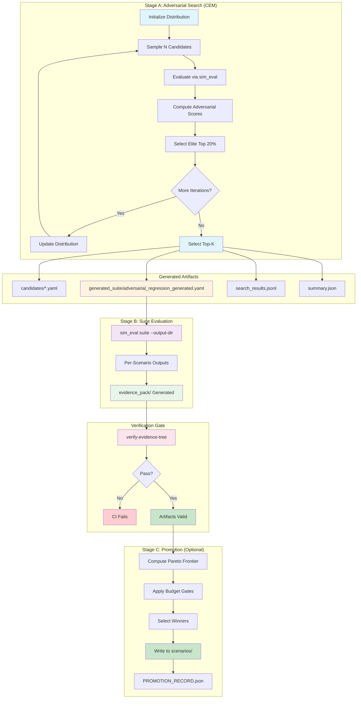
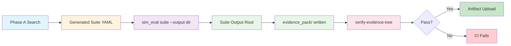

# Paraphina Whitepaper

This document has two parts:

1) **Code-derived whitepaper (implementation truth)** — describes what the current repository implements today (Rust sim + research toolchain), including invariants and known drift.
2) **Appendix: Canonical v1 target specification (VERBATIM)** — included exactly as provided, unedited, but annotated with implementation status markers.

---

## Implementation Status Legend

Throughout this document, algorithmic claims are annotated with one of:

- **Implemented: `path/to/file.rs::function_name`** — code exists and is tested
- **Planned (not yet implemented; milestone X)** — in roadmap but no code yet
- **Partial (milestone X)** — scaffolding exists but incomplete

For audit-grade provenance and integrity of simulation outputs, see `docs/EVIDENCE_PACK.md` (Evidence Pack v1 specification).

---

## Part I — Code-derived whitepaper (implementation truth)

### Scope and sources of truth

1) The Rust code under `src/` is the executable truth.
2) Research tooling under `tools/` and `batch_runs/` defines the data contracts used to evaluate/align behavior.
3) Tests in `tests/` (and any in-module tests) are the strongest statements of safety invariants.

Where the canonical spec differs from current code, that difference must be treated as **roadmap**, not assumed behavior.

---

## Repo architecture at a glance

> **Implementation References:** See EVIDENCE_PACK.md §1 (Core loop order), §8 (Research harness)

### Rust core (`src/`)

**Entrypoint**
- `src/main.rs`
  - CLI flags include `--ticks` and `--profile` (defaults to Balanced in the current wiring).
  - Builds config via `Config::from_env_or_profile(profile)` and runs `StrategyRunner::run_simulation()`.
  - **Implemented: `paraphina/src/main.rs`**

**Configuration**
- `src/config.rs`
  - Defines `Config` and `RiskProfile` presets.
  - Provides profile builders (`Config::for_profile`) and environment override logic (`Config::from_env_or_profile`, `Config::from_env_or_default`).
  - **Implemented: `paraphina/src/config.rs::Config`, `RiskProfile`**

**State + accounting**
- `src/state.rs`
  - `GlobalState`: fair value state, volatility/scalars, inventory, PnL, risk regime and limits.
  - `VenueState`: per-venue mids/spreads/depth, local vols, toxicity/health, position/funding, synthetic margin/liquidation distance (sim).
  - PnL accounting is implemented via:
    - `GlobalState::apply_perp_fill(...)` (realised PnL + fees)
    - `GlobalState::recompute_after_fills(...)` (inventory/basis + unrealised PnL marked to fair value)
  - **Implemented: `paraphina/src/state.rs::GlobalState`, `VenueState`**

**Engine tick**
- `src/engine.rs`
  - Orchestrates one main tick:
    1) fair value + vol update (KF + EWMA)
    2) toxicity/health update
    3) risk regime + limits update (warning/hardlimit + kill switch)
  - **Implemented: `paraphina/src/engine.rs::main_tick`, `update_fair_value_and_vol`, `update_risk_limits_and_regime`**

**Market making**
- `src/mm.rs`
  - Generates MM quotes from config + state.
  - Current gating behavior:
    - no FV → no quotes
    - kill switch → no quotes
    - HardLimit (Critical) regime → no quotes (Milestone C)
    - disabled venue → no quotes
  - Warning regime widens spreads and caps sizes.
  - **Implemented: `paraphina/src/mm.rs::compute_mm_quotes`, `compute_single_venue_quotes`** (see EVIDENCE_PACK.md §2)

**Hedging**
- `src/hedge.rs`
  - Generates a hedge plan when inventory exceeds a deadband.
  - Current gating behavior:
    - kill switch → no hedge
    - may still hedge in HardLimit (risk-reducing behavior)
  - **Implemented: `paraphina/src/hedge.rs::compute_hedge_plan`, `build_candidates`, `greedy_allocate`** (see EVIDENCE_PACK.md §4)

**Wiring + telemetry**
- `src/strategy.rs`
  - Runs the full loop: tick → MM quotes → hedge plan → intents → sim execution → recompute state.
  - Emits per-tick JSONL telemetry used by research tooling.
  - **Implemented: `paraphina/src/strategy.rs::StrategyRunner::run_simulation`** (see EVIDENCE_PACK.md §1)
- `src/telemetry.rs`
  - JSONL sink controlled by env vars (mode/path).
  - **Implemented: `paraphina/src/telemetry.rs`**

---

### Research toolchain (`tools/` + `batch_runs/`)

**Telemetry → dataset**
- `batch_runs/ts_metrics.py` loads tick telemetry JSONL and expects a `pnl_total` column.
- `tools/research_ticks.py` converts a telemetry file into one dataset record:
  - `final_pnl`
  - `max_drawdown`
  - `kill_switch` (any tick kill)
  - regime fractions (from `risk_regime`)

**World-model budgets + alignment**
- `tools/exp07_optimal_presets.py` defines `RISK_TIERS` (kill prob budget, drawdown budget, min mean pnl) and selects “best” presets from Exp04 outputs.
- `tools/exp11_research_alignment.py` compares empirical research runs vs those budgets and produces `runs/exp11_research_alignment/exp11_alignment.csv`.
- `tools/exp12_profile_safety_tuner.py` scales down exposure knobs if empirical behavior violates budgets.
- `tools/exp13_auto_research_harness.py` runs the binary under profiles with telemetry on, then runs dataset + summary + alignment steps.

**Batch orchestration + stdout parsing**
- `batch_runs/orchestrator.py` provides a generic way to run the binary with env overlays and parse stdout.
- `batch_runs/metrics.py` parses a human-readable end-of-run summary (`Daily PnL ...`, `Kill switch ...`) for older-style experiments.

---

## State and accounting model (current implementation)

> **Implementation References:** See EVIDENCE_PACK.md §1 (Core loop), §7 (Risk regime)

### Inventories
- Per venue, the engine tracks net TAO position `q_v` (TAO-equivalent perp delta).
- Global inventory is aggregated across venues: `q_global = Σ q_v`.
- **Implemented: `paraphina/src/state.rs::VenueState::position_tao`, `GlobalState::inventory`**

### Basis exposure
- The engine computes basis exposure relative to a synthetic fair value `S_t`:
  - net basis: `B = Σ q_v * (m_v - S_t)`
  - gross basis: `B_gross = Σ |q_v * (m_v - S_t)|`
- **Implemented: `paraphina/src/state.rs::GlobalState::recompute_after_fills`** (computes `basis_usd` and `basis_gross_usd`)

### PnL
- **Realised PnL** is updated on position reductions/flips (VWAP-style) and fees are applied in USD.
- **Unrealised PnL** marks per-venue inventory to fair value.
- **Daily total PnL** is realised + unrealised.

There are state-level unit tests validating key PnL identities.
- **Implemented: `paraphina/src/state.rs::GlobalState::apply_perp_fill`, `recompute_after_fills`**

---

## Fair value and volatility (current implementation)

> **Implementation References:** See EVIDENCE_PACK.md §5 (Fair value + volatility gating)

### Fair value (Kalman filter)
- The engine uses a 1D Kalman filter over **log price** to estimate fair value `S_t`.
- Observation quality is gated by (Milestone D gating policy):
  - **Venue health**: only Healthy venues (not Warning or Disabled) contribute observations
  - **Staleness gating**: venues with book data older than `stale_ms` are excluded
  - **Outlier gating**: venues whose mid deviates > `max_mid_jump_pct` from prior FV are excluded
  - **Min-healthy gating**: if fewer than `min_healthy_for_kf` venues pass all gates, measurement update is skipped (time-update only)
  - spread/depth affect observation variance R
- **Implemented: `paraphina/src/engine.rs::update_fair_value_and_vol`, `collect_kf_observations`**

### FV gating telemetry (Milestone D)
The engine tracks and exposes in telemetry:
- `fv_available`: bool — true if >= min_healthy_for_kf observations passed gating
- `fair_value`: the current fair value estimate (Option<f64>)
- `healthy_venues_used`: list of venue indices that contributed to the last FV update
- `healthy_venues_used_count`: count of healthy venues used

When `fv_available = false`, the engine performs a time update only (prediction step) and fair value degrades gracefully without jumping.

### Volatility + scalars
- EWMA volatility is computed on fair value log returns.
- **Volatility floor** (Milestone D): `sigma_eff = max(sigma_short, sigma_min)`
  - Ensures effective volatility never falls below the configured floor
  - `sigma_eff` is used by all downstream scalars
- A clipped vol ratio drives dynamic scalars:
  - spreads widen with vol (`spread_mult`)
  - sizes shrink with vol (`size_mult`)
  - hedge deadband shrinks with vol (`band_mult`)
- **Implemented: `paraphina/src/engine.rs::update_vol_and_scalars`**

---

## Risk management (current implementation)

> **Implementation References:** See EVIDENCE_PACK.md §7 (Risk regime + kill switch semantics)

### Risk regimes
- The engine maintains a risk regime:
  - `Normal`
  - `Warning`
  - `HardLimit` (current code's name; canonical spec calls this `Critical`)
- **Implemented: `paraphina/src/state.rs::RiskRegime`, `paraphina/src/engine.rs::update_risk_limits_and_regime`**

The regime is determined using combinations of:
- volatility-scaled delta limits
- basis exposure limits
- daily PnL loss limits

### Kill switch (Milestone C complete)
- Kill switch triggers on ANY hard breach: PnL, delta, basis, or liquidation distance.
- Kill switch is **latching**: once true, stays true until manual reset.
- Kill reason tracked via `KillReason` enum (`PnlHardBreach`, `DeltaHardBreach`, `BasisHardBreach`, `LiquidationDistanceBreach`).
- When kill switch is active, HardLimit (Critical) regime is forced for telemetry consistency.
- **Implemented: `paraphina/src/state.rs::KillReason`, `paraphina/src/engine.rs::update_risk_limits_and_regime` (L488-L510)**

---

## Market making (current implementation)

> **Implementation References:** See EVIDENCE_PACK.md §2 (Market making / quote model)

MM quotes are computed per venue based on:
- fair value
- volatility-adjusted spread/size scalars
- inventory-dependent skew
- venue health / toxicity / liquidation-distance constraints (sim)

**Non-negotiable today**:
- If kill switch is active OR risk regime is HardLimit, MM does not emit new quotes.
- HardLimit (Critical) regime implies kill_switch=true (Milestone C).

**Implemented:**
- Reservation price: `paraphina/src/mm.rs::compute_single_venue_quotes` (L419-L441)
- AS spread model: `paraphina/src/mm.rs` (L378-L415)
- Size model with quadratic objective: `paraphina/src/mm.rs` (L499-L624)
- Risk gating: `paraphina/src/mm.rs` (L182-L196, L346-L375)

---

## Hedging (current implementation)

> **Implementation References:** See EVIDENCE_PACK.md §4 (Hedge allocator)

The hedge controller:
- uses a volatility-adjusted deadband
- computes a risk-reducing adjustment toward zero inventory
- allocates across venues by a simple cost model (spread + taker fees + toxicity penalty)
- caps per-step size

**Non-negotiable today**:
- If kill switch is active, hedging is disabled (Milestone C).

**Known gaps vs canonical** (future work):
- None; Milestone F complete.

**Milestone F Complete:**
- Per-venue margin constraint enforcement (only caps when increasing abs exposure).
- Multi-chunk allocation per venue with deterministic tie-breaking (aggregated into single order per venue).
- Convexity cost option for spreading flow across venues.
- See `hedge.rs` helper functions: `increases_abs_exposure`, `compute_abs_limit_after_trade`, `cap_dq_by_abs_limit`, `build_chunk_candidates`, `greedy_allocate_chunks`.

**Implemented:**
- Deadband: `paraphina/src/hedge.rs::compute_hedge_plan` (L135-L148)
- Cost model: `paraphina/src/hedge.rs::build_candidates` (L298-L361)
- Greedy allocation: `paraphina/src/hedge.rs::greedy_allocate` (L380-L427)

---

## Telemetry contract (research-critical)

> **Implementation References:** See EVIDENCE_PACK.md §8 (Research harness + metrics)

The research pipeline assumes the tick telemetry JSONL contains (at minimum):
- `t` (tick index or time)
- `pnl_total`
- `risk_regime`
- `kill_switch`

Breaking this contract breaks `batch_runs/ts_metrics.py` and `tools/research_ticks.py`.

**Implemented:**
- Stdout parser: `batch_runs/metrics.py::parse_daily_summary` (L50-L88)
- Telemetry sink: `paraphina/src/telemetry.rs`
- Research harness: `batch_runs/orchestrator.py`

---

## Known drift (canonical spec vs current implementation)

These are the highest-impact mismatches currently observed in the repo wiring and tools:

1) ~~**CLI profile vs env profile precedence**~~ **FIXED**
   - Profile precedence is now correct: CLI arg > env var > scenario file > default.
   - Both `monte_carlo` and `sim_eval` binaries support `--profile` argument.
   - `PARAPHINA_RISK_PROFILE` env var is properly honored when no CLI arg is provided.
   - Explicit startup log line: `effective_risk_profile=<profile> source=<cli|env|scenario|default>`
   - See `config.rs::resolve_effective_profile()` and tests in `config_profile_tests.rs`.

2) ~~**HardLimit still allows MM quotes**~~ **FIXED (Milestone C)**
   - HardLimit (Critical) regime now implies `kill_switch=true`.
   - MM, hedge, and exit engines all gate on `kill_switch`, stopping all new orders.
   - See `engine.rs::update_risk_limits_and_regime()`.

3) ~~**Kill switch not latching**~~ **FIXED (Milestone C)**
   - Kill switch is now latching: once triggered, stays true until manual reset.
   - Kill switch triggers on ANY hard breach: PnL, delta, basis, or liquidation distance.
   - Kill reason is tracked via `KillReason` enum for diagnostics.
   - Tests in `tests/risk_regim_tests.rs` cover all breach scenarios.

4) **Tooling/doc footguns**
   - Exp12 filename spelling mismatch exists in docs (fix in tools/RESEARCH.md or provide shim).
   - Exp07 prints a Rust snippet that can invert daily loss limit sign (should be fixed before copy/paste usage).

---

## Invariants (must not be weakened)

1) **Telemetry schema**: do not rename/remove `pnl_total`, `risk_regime`, `kill_switch`, `t` without updating research tooling and versioning.
2) **Loss limit semantics**: daily loss limit is stored as a positive magnitude; the hard threshold is `-abs(limit)`.
3) **Kill switch disables new risk**: MM and hedge must not produce new intents once kill is active.
4) **PnL correctness**: realised and unrealised PnL identities must remain true; extend tests if refactoring.

---

## Subsystem status (Implemented / Partial / Planned)

| Subsystem | Status | Notes |
|---|---|---|
| Config + risk profiles | Implemented | Presets + env overrides exist; CLI/env precedence needs tightening |
| Fair value KF | Implemented | KF on log price with staleness/outlier/min-healthy gating (Milestone D) |
| FV gating telemetry | Implemented | Milestone D: fv_available, healthy_venues_used, healthy_venues_used_count |
| Volatility scalars | Implemented | EWMA vol + spread/size/band scalars; sigma_eff floor enforced (Milestone D) |
| PnL accounting | Implemented | Realised + unrealised + fees; tests exist |
| Risk regimes | Implemented | Normal/Warning/HardLimit (Critical) |
| Kill switch | Implemented (latching) | Milestone C: triggers on any hard breach, latches until reset |
| MM quoting | Implemented | Stops on kill_switch OR HardLimit (Milestone C) |
| Hedging | Partial | Cost model is simplified vs canonical; stops on kill_switch |
| Cross-venue exits | Implemented (Milestone E) | Full allocator with net edge, basis/funding, fragmentation; lot size + min notional enforcement |
| RL-1: Gym-style env | Implemented | SimEnv/VecEnv with Python bindings via paraphina_env crate |
| RL-2: BC baseline | Implemented | Action encoding, trajectory collection, Python BC training scripts |
| Evidence Pack v1 | Implemented (Step 6) | Audit-grade provenance for sim_eval outputs; see `docs/EVIDENCE_PACK.md` |
| Evidence Pack Verifier + CI Gate | Implemented (Step 7) | Strict verifier CLI + CI gate verifies extracted bundles |
| Production I/O | Planned | Current focus is deterministic sim + telemetry |

### Milestone E: Cross-venue Exit Allocator (Section 12)

**Status: Implemented**

> **Implementation References:** See EVIDENCE_PACK.md §3 (Exit engine)

The exit allocator runs after MM fill batches and before hedge, implementing the canonical
Section 12 cross-venue exit optimization with the following features:

**Edge calculation:**
- Net edge = base_profit - fees - slippage_buffer - vol_buffer + basis_adj + funding_adj - penalties + bonuses
- Slippage model: linear + quadratic (`slippage = linear_coeff * size + quadratic_coeff * size²`)
- Volatility buffer: `vol_buffer = vol_buffer_mult * sigma_eff * fair_value`
- Basis/funding adjustments weight venue selection by carry advantage

**Fragmentation and basis-risk handling:**
- Fragmentation penalty for opening new legs or increasing venue exposure
- Fragmentation reduction bonus for closing positions entirely (consolidation)
- Basis-risk penalty for trades that increase |B_t| (signed basis exposure)
- Deterministic tie-breaking: when edges are similar, prefers actions that reduce fragmentation/basis-risk

**Per-venue constraints:**
- `lot_size_tao`: minimum order size per venue
- `size_step_tao`: size increment (orders rounded to multiples)
- `min_notional_usd`: minimum notional value per order
- If rounding makes size too small or below min-notional, venue is skipped

**Gating (unchanged from prior implementation):**
- Skip disabled, toxic (≥tox_high), stale venues
- Skip venues without fair value / valid book data
- Liquidation distance safety caps (reduce-only mode near LIQ_WARN/LIQ_CRIT)

**Approximations and known limitations:**
- **Depth model**: Uses `depth_near_mid` as a proxy for top-of-book depth; no full L2 orderbook
- **Slippage model**: Linear + quadratic approximation; real market impact may differ
- **Entry reference**: Uses weighted average entry price across venues (no full fill ledger)
- **Basis-risk**: Linear approximation of Δ|B| change; actual impact is non-linear for large trades

**Test coverage:**
- `exit_respects_lot_size_and_min_notional`: verifies lot size rounding and min notional enforcement
- `exit_prefers_less_fragmentation_when_edges_similar`: verifies deterministic fragmentation preference
- `exit_prefers_less_basis_risk_when_edges_similar`: verifies basis-risk penalty behavior
- `exit_deterministic_ordering_with_identical_edges`: proves deterministic tie-breaking
- Existing tests: profit-only, skip disabled/toxic/stale, splits across best venues with per-venue caps

**Wiring (strategy loop order):**
```
MM quotes → MM fills → recompute → EXIT → recompute → hedge → recompute
```
This ordering is enforced in both `src/strategy.rs` and `src/bin/monte_carlo.rs`.

---

### RL-1: Gym-style Environment and Vectorised Simulation (Implemented)

**Status: Implemented**

> **Implementation References:** See EVIDENCE_PACK.md §9 (RL / training scaffolding)

Per ROADMAP.md RL-1, this milestone provides a Gym-style RL environment for training policies without modifying baseline trading behaviour.

**Components:**

1. **`paraphina_env` crate** - PyO3 Python bindings exposing:
   - `Env` class with `reset(seed=None)` and `step(action)` methods
   - `VecEnv` class for N parallel environments with `reset_all(seeds)` and `step(actions)`
   - All observations derive from the RL-0 `Observation` schema and remain versioned

2. **`SimEnv`** - Rust Gym-style environment wrapper:
   - Wraps the existing simulation engine without duplicating logic
   - `reset(seed)` returns initial observation with domain randomisation applied
   - `step(action)` applies PolicyAction modifiers and returns (obs, reward, done, info)
   - Deterministic given seed: same seed + same actions = identical outputs

3. **`VecEnv`** - Vectorised environment for parallel rollouts:
   - Manages N independent `SimEnv` instances
   - `reset_all(seeds)` resets all environments (random seeds if None)
   - `step(actions)` steps all environments and returns batched results
   - Deterministic per-environment given respective seeds

4. **Domain Randomisation** (`DomainRandConfig`, `DomainRandSampler`):
   - Deterministic sampling from seed for: fees, spreads, slippage, funding regimes, volatility regimes, venue staleness/disable events
   - Presets: `default()`, `mild()`, `deterministic()` for different training stages

**Usage Example (Python):**

```python
import paraphina_env

# Single environment
env = paraphina_env.Env(max_ticks=1000, apply_domain_rand=True)
obs = env.reset(seed=42)
action = env.identity_action()  # baseline behaviour
obs, reward, done, info = env.step(action)

# Vectorised environments
vec_env = paraphina_env.VecEnv(n=8, max_ticks=1000)
observations = vec_env.reset_all(seeds=[100, 200, 300, 400, 500, 600, 700, 800])
actions = vec_env.identity_actions()
observations, rewards, dones, infos = vec_env.step(actions)
```

**Test Coverage:**
- `test_sim_env_determinism_same_seed_same_actions`: verifies byte-identical outputs
- `test_sim_env_determinism_with_domain_rand`: determinism with domain randomisation
- `test_vec_env_determinism`: vectorised environment determinism across all envs
- `test_vec_env_smoke`: basic VecEnv stepping smoke test
- `test_domain_rand_sampler_determinism`: domain randomisation sampler determinism

**Key Design Decisions:**
- RL-1 is simulation-mode only; baseline trading behaviour unchanged
- Actions map to existing RL-0 `PolicyAction` control surface (spread_scale, size_scale, hedge_scale, etc.)
- Errors converted to Python exceptions via PyO3
- APIs designed small and stable for forward compatibility

---

### RL-2: Imitation Learning Baseline (Behaviour Cloning) (Implemented)

**Status: Implemented**

> **Implementation References:** See EVIDENCE_PACK.md §9 (RL / training scaffolding)

Per ROADMAP.md RL-2, this milestone provides a behaviour cloning baseline that trains a neural network policy to imitate the HeuristicPolicy.

**Components:**

1. **Action Encoding** (`src/rl/action_encoding.rs`):
   - Versioned action vector encoding (ACTION_VERSION = 1)
   - Bounded control surface mapped to normalized vectors
   - Per-venue: spread_scale [0.5, 3.0] → [0, 1], size_scale [0.0, 2.0] → [0, 1], rprice_offset [-10, 10] → [-1, 1]
   - Global: hedge_scale [0.0, 2.0] → [0, 1], hedge_venue_weights (simplex)
   - Round-trip encode/decode with clamping semantics
   - Total action dimension: 3×num_venues + 1 + num_venues = 21 (for 5 venues)

2. **Observation Encoding** (`src/rl/trajectory.rs`):
   - Global features (17): fair_value, sigma_eff, vol_ratio_clipped, spread/size/band_mult, inventory, basis, pnl, risk state
   - Per-venue features (14×num_venues): mid, spread, depth, staleness, local_vol, status (one-hot), toxicity, position, funding, margin, dist_liq_sigma
   - Total observation dimension: 17 + 14×num_venues = 87 (for 5 venues)

3. **Trajectory Collection** (`src/rl/trajectory.rs`):
   - `TrajectoryCollector`: vectorised rollouts with HeuristicPolicy
   - `TrajectoryRecord`: (obs_features, action_target, reward, terminal, kill_reason, episode_idx, step_idx, seed)
   - `TrajectoryMetadata`: version info, collection config, stats (kill_rate, mean_episode_length, mean_pnl)
   - Deterministic: same seed → identical output

4. **Python Bindings** (`paraphina_env/src/lib.rs`):
   - `TrajectoryCollector` class with `collect(num_episodes)` and `collect_arrays(num_episodes)`
   - `obs_version()`, `action_version()`, `trajectory_version()` functions

5. **Python Scripts** (`python/rl2_bc/`):
   - `generate_dataset.py`: collect trajectories, save as NPY arrays + JSON metadata
   - `train_bc.py`: PyTorch MLP training with deterministic seeding
   - `eval_bc.py`: holdout error + rollout comparison vs heuristic

**Dataset Format:**

```
{output_dir}/
  metadata.json      # versions, config, stats
  observations.npy   # [N, 87] float32
  actions.npy        # [N, 21] float32
  rewards.npy        # [N] float32
  terminals.npy      # [N] bool
  episode_indices.npy # [N] uint32
```

**metadata.json schema:**
```json
{
  "trajectory_version": 1,
  "obs_version": 1,
  "action_version": 1,
  "policy_version": "heuristic-v1.0.0",
  "base_seed": 42,
  "num_episodes": 100,
  "num_transitions": 50000,
  "obs_dim": 87,
  "action_dim": 21,
  "domain_rand_preset": "deterministic",
  "kill_rate": 0.05,
  "mean_episode_length": 500.0,
  "mean_pnl": 10.5
}
```

**Test Coverage:**
- `test_action_encoding_determinism_identity`: identity action encoding is deterministic
- `test_action_encoding_round_trip_identity`: encode/decode preserves values
- `test_action_encoding_clamping`: out-of-bounds values are clamped
- `test_trajectory_collection_determinism_small`: same seed → identical trajectories
- `test_trajectory_collection_different_seeds`: different seeds → different trajectories
- `test_heuristic_policy_determinism`: policy is deterministic on same observation

**Exit Criteria (per ROADMAP.md):**
- Action prediction MAE < 0.1 on holdout data
- Rollout kill rate ≤ heuristic kill rate × 1.1
- Rollout mean PnL ≥ heuristic mean PnL × 0.9

**Reproducibility:**
- Rust trajectory collection: deterministic given seed
- Python training: deterministic with `torch.use_deterministic_algorithms(True)`
- Known limitation: GPU cuDNN may introduce minor non-determinism; use CPU for full reproducibility

**Usage:**

```bash
# Generate dataset
python python/rl2_bc/generate_dataset.py \
    --num-episodes 1000 --seed 42 --output-dir runs/rl2_data

# Train BC policy
python python/rl2_bc/train_bc.py \
    --data-dir runs/rl2_data --output-dir runs/rl2_model --epochs 100

# Evaluate
python python/rl2_bc/eval_bc.py \
    --model-dir runs/rl2_model --eval-holdout --eval-rollout
```

---

### Step 6: Evidence Pack v1 (Implemented)

**Status: Implemented**

> **Specification:** See `docs/EVIDENCE_PACK.md`

Step 6 introduces an audit-grade Evidence Pack for `sim_eval` outputs, providing provenance and integrity guarantees.

**Deliverables:**

1. **Directory structure**: `<output_root>/evidence_pack/{manifest.json, suite.yaml, SHA256SUMS}`
2. **manifest.json**: Schema version, timestamps, git commit, Cargo.lock hash, suite metadata, artifact checksums
3. **SHA256SUMS**: Standard format verifiable via `sha256sum -c`
4. **Determinism**: Relative paths only, stable ordering (sorted by path), atomic writes

**Non-goals (v1):**
- Cryptographic signing/attestation (reserved for future versions)
- Full environment capture (reserved for future versions)

**Acceptance Criteria:**
- Evidence pack generated for every sim_eval run
- `sha256sum -c evidence_pack/SHA256SUMS` passes from output root
- Manifest contains all required fields per `docs/EVIDENCE_PACK.md`
- CI produces and archives evidence pack as build artifact

---

### Step 7: Evidence Pack Verifier + CI Gate (Implemented)

**Status: Implemented**

> **Implementation:** `sim_eval verify-evidence-tree` CLI command + CI gate in `.github/workflows/sim_eval_research.yml`

Step 7 adds a strict offline verifier for evidence packs and integrates verification into CI as a gate.

**Deliverables:**

1. **Strict verifier**: `verify-evidence-tree` command validates manifest schema, checksums, and directory structure
2. **CLI interface**: `sim_eval verify-evidence-tree <extracted_bundle_root>` for offline verification
3. **CI gate**: Workflow extracts bundled evidence pack and runs verifier before artifact upload
4. **Additive verification**: Complements existing `sha256sum -c` checks; does not replace them

**Step 7.1: Operator CLI + Monte Carlo Evidence Pack**

*Verifier CLI:*
- Provides `verify-evidence-pack` and `verify-evidence-tree` subcommands for operators to verify bundles offline
- Exit codes: `0` (pass), `3` (verification failure), `2` (I/O/usage error)
- See `docs/EVIDENCE_PACK.md` § Offline Verification (CLI) for usage examples

*Monte Carlo Evidence Pack:*
- The `monte_carlo` binary now generates Evidence Pack v1 artifacts
- Default output directory: `runs/demo_step_7_1/`
- Outputs: `mc_summary.json`, `monte_carlo.yaml`, and `evidence_pack/` with manifest, suite.yaml, SHA256SUMS
- Verification: `sim_eval verify-evidence-pack runs/demo_step_7_1` or `sim_eval verify-evidence-tree runs`

**Usage:**
```bash
# Run Monte Carlo (generates evidence pack)
cargo run -p paraphina --bin monte_carlo

# Verify single evidence pack
cargo run -p paraphina --bin sim_eval -- verify-evidence-pack runs/demo_step_7_1

# Verify all evidence packs under runs/
cargo run -p paraphina --bin sim_eval -- verify-evidence-tree runs
```

**Acceptance Criteria:**
- `sim_eval verify-evidence-tree` exists and validates extracted bundles
- `monte_carlo` generates valid Evidence Pack v1 at `runs/demo_step_7_1/`
- `verify-evidence-pack` and `verify-evidence-tree` succeed on monte_carlo output
- CI workflow verifies every evidence pack bundle before upload
- Verification failures block artifact upload

---

## Phase A: Adversarial Search and Promotion Pipeline

This section specifies the Phase A two-stage procedure for discovering adversarial failure scenarios and promoting verified candidates to stable regression suites.

> **Related specifications:**
> - [PHASE_A_ADVERSARIAL_SEARCH.md](PHASE_A_ADVERSARIAL_SEARCH.md) — CEM search operator guide
> - [PHASE_A_PROMOTION_PIPELINE.md](PHASE_A_PROMOTION_PIPELINE.md) — multi-objective tuning and promotion
> - [EVIDENCE_PACK.md](EVIDENCE_PACK.md) — evidence pack format and verification

### System Overview

Phase A implements institutional-grade scenario discovery and promotion in two distinct stages:

**Stage A: Adversarial Search (CEM)**
- Explores the scenario parameter space using Cross-Entropy Method (CEM)
- Scores candidates by an adversarial objective favouring failure conditions
- Produces candidate scenario YAML files and a generated suite

**Stage B: Promotion Pipeline**
- Evaluates candidates via Monte Carlo + suite gating
- Computes a Pareto frontier over multiple risk/reward objectives
- Applies confidence-aware budget gates per risk tier
- Promotes winners to committed suites with full provenance

Both stages produce cryptographically verifiable evidence packs.

#### Key Definitions

| Term | Definition |
|------|------------|
| **Study Directory** | The output root for a search or promotion run. For CEM search: `runs/phaseA_adv_search/<study_id>/`. For promotion pipeline: `runs/phaseA/<study>/`. |
| **Candidate** | A scenario configuration generated by search. Defined by scenario parameters (vol, spread, latency, etc.) and a risk profile. |
| **Generated Suite** | A suite YAML produced by search, located at `<study_dir>/generated_suite/adversarial_regression_generated.yaml`. Self-contained and runnable. |
| **Trial** | A single evaluation of a candidate in the promotion pipeline. Each trial creates an isolated directory: `<study_dir>/trial_<idx>_<hash>/`. |
| **Promotion** | Writing verified, budget-passing candidates to `scenarios/suites/` and `scenarios/v1/adversarial/promoted_v1/`. Requires explicit `--promote-suite` flag. |
| **Risk Profile** | One of: `balanced`, `conservative`, `aggressive`, `research`. Determines budget thresholds and strategy parameters. |
| **Budget** | Per-tier thresholds for promotion eligibility. Defined in `batch_runs/phase_a/budgets.yaml`. Gates on kill rate UCB, drawdown CVaR, and PnL LCB. |

---

### Algorithmic Description

#### Cross-Entropy Method (CEM) for Adversarial Search

The CEM search maintains a parametric distribution over scenario parameters and iteratively updates it toward high-adversarial-score regions.

**Sampling Distribution:**

For each continuous parameter \( p \in \{\text{vol}, \text{vol\_multiplier}, \text{jump\_intensity}, \ldots\} \):

\[
p_i \sim \mathcal{N}(\mu_p, \sigma_p), \quad \text{clipped to } [L_p, H_p]
\]

where \( [L_p, H_p] \) are the parameter bounds defined in `ADVERSARIAL_PARAM_BOUNDS`.

**Parameter Bounds:**

| Parameter | Bounds | Description |
|-----------|--------|-------------|
| `vol` | [0.005, 0.05] | Base volatility |
| `vol_multiplier` | [0.5, 3.0] | Volatility scaling |
| `jump_intensity` | [0.0001, 0.002] | Jump events per step |
| `jump_sigma` | [0.01, 0.10] | Jump magnitude |
| `spread_bps` | [0.5, 5.0] | Spread in basis points |
| `latency_ms` | [0.0, 50.0] | Latency in milliseconds |
| `init_q_tao` | [-60.0, 60.0] | Initial inventory |
| `daily_loss_limit` | [300.0, 3000.0] | Loss limit (USD) |

**Adversarial Scoring:**

Each candidate is scored to maximise failure likelihood:

\[
\text{score} = 1000 \cdot \mathbf{1}_{\text{kill}} + 10 \cdot \text{max\_drawdown} - 0.1 \cdot \text{mean\_pnl}
\]

Priority order:
1. Kill switch triggered (weight: 1000)
2. Large drawdown (weight: 10)
3. Negative PnL (weight: -0.1)

**Elite Selection:**

After evaluating \( N \) candidates per iteration, select the top \( \lfloor \rho \cdot N \rfloor \) by adversarial score, where \( \rho = 0.2 \) (elite fraction).

**Distribution Update:**

For each parameter \( p \), update toward elite statistics:

\[
\mu_p^{(t+1)} = (1 - \eta) \mu_p^{(t)} + \eta \cdot \bar{p}_{\text{elite}}
\]
\[
\sigma_p^{(t+1)} = \max\left( (1 - \eta) \sigma_p^{(t)} + \eta \cdot s_{p,\text{elite}}, \, 0.05 \cdot (H_p - L_p) \right)
\]

where \( \eta = 0.5 \) is the learning rate and \( s_{p,\text{elite}} \) is the elite sample standard deviation. The floor prevents distribution collapse.

**Termination:**

The search runs for \( I \) iterations (configurable via `--iterations`). Default: \( I = 3 \).

**CEM Pseudocode:**

```
function CEM_ADVERSARIAL_SEARCH(iterations I, pop_size N, elite_frac ρ, seed):
    dist ← INIT_DISTRIBUTION()  # means at center, stds at 1/4 range
    all_results ← []
    
    for iter = 1 to I:
        candidates ← SAMPLE(dist, N, seed + iter)
        
        for each candidate c in candidates:
            result ← EVALUATE(c)  # run sim_eval, parse metrics
            result.score ← 1000*kill + 10*drawdown - 0.1*pnl
            all_results.append(result)
        
        valid ← [r for r in all_results if r.verified]
        ranked ← SORT_DESC(valid, by=score)
        elite ← ranked[0 : floor(ρ * len(ranked))]
        
        UPDATE_DISTRIBUTION(dist, elite, learning_rate=0.5)
    
    top_k ← SELECT_TOP_K(all_results)
    WRITE_GENERATED_SUITE(top_k)
    return all_results, top_k
```

---

#### Promotion Pipeline Flow

The promotion pipeline evaluates candidates through Monte Carlo simulation and suite gating, then selects winners via multi-objective optimisation.

**Pipeline Stages:**

```
function PROMOTION_PIPELINE(candidates, budgets, seed):
    results ← []
    
    # Stage 1: Evaluate all candidates
    for i, config in enumerate(candidates):
        trial ← CREATE_TRIAL_DIR(study_dir, config)
        
        # Monte Carlo evaluation
        mc_metrics ← RUN_MONTE_CARLO(trial/mc, config, seed + i)
        VERIFY_EVIDENCE(trial/mc)
        
        # Suite gating
        RUN_SUITE(research_v1.yaml, trial/suite/research_v1, config)
        VERIFY_EVIDENCE(trial/suite/research_v1)
        
        RUN_SUITE(adversarial_regression.yaml, trial/suite/adversarial, config)
        VERIFY_EVIDENCE(trial/suite/adversarial)
        
        # Compute confidence bounds
        pnl_lcb ← NORMAL_LCB(mc_metrics.pnl_mean, mc_metrics.pnl_stdev, n, α)
        kill_ucb ← WILSON_UCB(mc_metrics.kill_count, n, α)
        
        results.append((config, mc_metrics, pnl_lcb, kill_ucb))
    
    # Stage 2: Compute Pareto frontier
    valid ← [r for r in results if r.verified and r.suites_passed]
    pareto ← COMPUTE_PARETO(valid)  # non-dominated set
    
    # Stage 3: Budget gating and winner selection
    promotions ← {}
    for tier, budget in budgets:
        qualifying ← [r for r in valid if PASSES_BUDGET(r, budget)]
        winner ← SELECT_WINNER(qualifying)  # deterministic tie-break
        if winner:
            PROMOTE(winner, tier)
            promotions[tier] = winner
    
    WRITE_EVIDENCE_PACK(study_dir)
    return results, pareto, promotions
```

**Pareto Dominance:**

A candidate \( A \) dominates candidate \( B \) iff:
- \( A.\text{pnl\_mean} \geq B.\text{pnl\_mean} \)
- \( A.\text{kill\_ucb} \leq B.\text{kill\_ucb} \)
- \( A.\text{dd\_cvar} \leq B.\text{dd\_cvar} \)
- At least one inequality is strict

The Pareto frontier contains all non-dominated candidates.

**Winner Selection (Deterministic):**

For each tier, select the single winner using:
1. Filter by budget constraints (using confidence bounds)
2. Sort by `pnl_mean` descending (highest first)
3. Tie-break: lowest `dd_cvar`
4. Tie-break: lowest `kill_ucb`
5. Final tie-break: `candidate_id` alphabetically

---

### Metrics and Gates

#### Metric Definitions

| Metric | Source | Direction | Description |
|--------|--------|-----------|-------------|
| `pnl_mean` | `mc_summary.json` | Higher is better | Mean PnL across MC runs (USD) |
| `pnl_stdev` | `mc_summary.json` | — | Standard deviation of PnL (USD) |
| `pnl_lcb` | Computed | Higher is better | Lower confidence bound of mean PnL (Normal LCB) |
| `dd_cvar` | `mc_summary.json` | Lower is better | CVaR of max drawdown at 95% (USD) |
| `kill_rate` | `mc_summary.json` | Lower is better | Point estimate of kill probability (k/n) |
| `kill_ucb` | Computed | Lower is better | Upper confidence bound of kill rate (Wilson UCB) |
| `adversarial_score` | Computed | Higher = worse | Composite adversarial objective |

#### Confidence Bound Methods

**Kill Rate Upper Bound (Wilson Score):**

For \( k \) kills in \( n \) runs at significance \( \alpha \):

\[
\text{UCB} = \frac{\hat{p} + \frac{z^2}{2n} + z\sqrt{\frac{\hat{p}(1-\hat{p})}{n} + \frac{z^2}{4n^2}}}{1 + \frac{z^2}{n}}
\]

where \( \hat{p} = k/n \) and \( z = \Phi^{-1}(1-\alpha) \).

**PnL Lower Bound (Normal z-interval):**

\[
\text{LCB} = \bar{x} - z \cdot \frac{s}{\sqrt{n}}
\]

where \( \bar{x} \) is the sample mean, \( s \) is the sample standard deviation, and \( z = \Phi^{-1}(1-\alpha) \).

#### Budget Definitions

Budgets are defined in `batch_runs/phase_a/budgets.yaml`:

```yaml
alpha: 0.05  # 95% confidence level

conservative:
  max_kill_ucb: 0.05      # UCB of kill probability
  max_dd_cvar: 500.0      # CVaR of drawdown (USD)
  min_pnl_lcb_usd: 10.0   # LCB of mean PnL (USD)

balanced:
  max_kill_ucb: 0.10
  max_dd_cvar: 1000.0
  min_pnl_lcb_usd: 20.0

aggressive:
  max_kill_ucb: 0.15
  max_dd_cvar: 2000.0
  min_pnl_lcb_usd: 30.0

research:
  max_kill_ucb: 0.20
  max_dd_cvar: 3000.0
  min_pnl_lcb_usd: 0.0
```

A candidate passes a tier budget iff:
- `kill_ucb ≤ max_kill_ucb`
- `dd_cvar ≤ max_dd_cvar`
- `pnl_lcb ≥ min_pnl_lcb_usd`
- All evidence packs verified
- All required suites passed

**Fail Closed:** If any required statistic is NaN, the candidate does NOT pass.

---

### Artifacts and Directory Layout

#### CEM Search Output Structure

```
runs/phaseA_adv_search/<study_id>/
├── candidates/                              # Top-K scenario YAML files
│   ├── adv_s00042_a1b2c3d4.yaml
│   ├── adv_s00043_e5f6g7h8.yaml
│   └── ...
├── generated_suite/                         # Self-contained runnable suite
│   └── adversarial_regression_generated.yaml
├── runs/                                    # Per-candidate run outputs
│   ├── cem_i00_c0000_s42/
│   │   ├── scenario.yaml
│   │   └── <sim_eval outputs>/
│   └── ...
├── evidence_pack/                           # Root evidence pack
│   ├── SHA256SUMS
│   ├── manifest.json
│   └── suite.yaml
├── search_results.jsonl                     # All candidates (one JSON per line)
└── summary.json                             # CEM stats + top-K list
```

#### Promotion Pipeline Output Structure

```
runs/phaseA/<study>/
├── _baseline_cache/                         # ADR baseline cache (if enabled)
│   └── <profile>/<suite_name>/
├── trial_0000_<hash>/                       # Per-trial isolated directory
│   ├── candidate.env                        # Configuration overrides
│   ├── mc/                                  # Monte Carlo outputs
│   │   ├── mc_summary.json
│   │   └── evidence_pack/
│   ├── suite/                               # Suite outputs (with --output-dir)
│   │   ├── research_v1/
│   │   │   └── evidence_pack/
│   │   └── adversarial_regression_v2/
│   │       └── evidence_pack/
│   └── report/                              # ADR reports (if enabled)
│       ├── research_v1.md
│       └── research_v1.json
├── evidence_pack/                           # Root evidence pack
│   ├── SHA256SUMS
│   └── manifest.json
├── trials.jsonl                             # All trial results
├── pareto.json                              # Pareto frontier candidates
└── pareto.csv                               # Pareto frontier as CSV
```

#### Promoted Scenario Structure

When `--promote-suite` is passed:

```
scenarios/
├── v1/
│   └── adversarial/
│       └── promoted_v1/                     # Promoted scenario files
│           ├── adv_s00042_a1b2c3d4.yaml
│           └── ...
└── suites/
    ├── adversarial_regression_v3.yaml       # Canonical promoted suite
    └── PROMOTION_RECORD.json                # Audit trail
```

---

### Operator Recipes

#### End-to-End CEM Search + Suite Evaluation

```bash
# Step 1: Run CEM adversarial search (smoke mode for testing)
python3 -m batch_runs.phase_a.adversarial_search_promote \
  --smoke --out runs/phaseA_adv_search_smoke

# Step 2: Verify the search evidence pack
sim_eval verify-evidence-pack runs/phaseA_adv_search_smoke

# Step 3: Run the generated suite
cargo run -p paraphina --bin sim_eval -- suite \
  runs/phaseA_adv_search_smoke/generated_suite/adversarial_regression_generated.yaml \
  --output-dir runs/adv_reg_cem_smoke --verbose

# Step 4: Verify suite evidence tree
sim_eval verify-evidence-tree runs/adv_reg_cem_smoke
```

#### Full CEM Search with Promotion

```bash
# Run full CEM search (5 iterations, 20 candidates each)
python3 -m batch_runs.phase_a.adversarial_search_promote \
  --iterations 5 \
  --pop-size 20 \
  --elite-frac 0.2 \
  --top-k 10 \
  --seed 42 \
  --out runs/adv_cem_full

# Promote to scenarios/ (only when ready for commit)
python3 -m batch_runs.phase_a.adversarial_search_promote \
  --iterations 5 --pop-size 20 --top-k 10 --promote-suite

# Verify and commit
ls scenarios/v1/adversarial/promoted_v1/
cat scenarios/suites/PROMOTION_RECORD.json
git add scenarios/
git commit -m "Promote CEM adversarial scenarios v3"
```

#### Promotion Pipeline with Confidence-Aware Gating

```bash
# Run promotion pipeline (smoke mode)
python3 -m batch_runs.phase_a.promote_pipeline \
  --smoke --study-dir runs/phaseA_smoke

# Verify all evidence packs
sim_eval verify-evidence-tree runs/phaseA_smoke

# Inspect results
cat runs/phaseA_smoke/pareto.json
cat runs/phaseA_smoke/trials.jsonl
```

---

### Evidence and Audit Trail Integration

Phase A outputs integrate with the Evidence Pack v1 system for full auditability.

#### Evidence Pack Generation

Both search and promotion pipelines automatically generate root evidence packs after completion:

1. **CEM Search**: Writes `evidence_pack/` under the study directory after all candidates are evaluated
2. **Promotion Pipeline**: Writes `evidence_pack/` covering `trials.jsonl`, `pareto.json`, and all trial subdirectories
3. **Suite Runs**: Each `sim_eval suite` call generates nested evidence packs per scenario

#### Evidence Pack Locations

| Stage | Evidence Pack Location |
|-------|------------------------|
| CEM Search root | `runs/phaseA_adv_search/<study_id>/evidence_pack/` |
| Promotion Pipeline root | `runs/phaseA/<study>/evidence_pack/` |
| Trial MC output | `<trial_dir>/mc/evidence_pack/` |
| Trial suite output | `<trial_dir>/suite/<suite_name>/evidence_pack/` |

#### Verification Commands

```bash
# Verify a single evidence pack
sim_eval verify-evidence-pack runs/phaseA_adv_search_smoke

# Verify all evidence packs recursively
sim_eval verify-evidence-tree runs/phaseA_adv_search_smoke

# Verify the entire runs/ tree
sim_eval verify-evidence-tree runs
```

**Promotion Requires Verified Evidence:**

Candidates are only eligible for promotion if:
- Their trial directory passes `verify-evidence-tree`
- All suite evidence packs are valid
- MC output evidence pack is valid

---

### CI and Reproducibility Contract

#### Determinism Guarantees

Given the same `--seed`:
- CEM produces identical candidate sequences per iteration
- Adversarial scores are computed identically
- Top-K selection is deterministic
- Scenario filenames are stable: `adv_s{seed:05d}_{hash8}.yaml`
- Suite YAML content is byte-identical

**Deterministic Tie-Breaking:**

All sorting operations use stable, multi-key tie-breaking:
- CEM ranking: `(-adversarial_score, seed, candidate_id)`
- Winner selection: `(-pnl_mean, dd_cvar, kill_ucb, candidate_id)`
- Pareto output: sorted by `candidate_id`

#### CI Enforcement

CI workflows MUST enforce:

1. **Smoke mode completes without error** — The `--smoke` flag exercises the full pipeline with reduced parameters
2. **Evidence verification passes** — All evidence packs must verify before artifacts are uploaded
3. **No promotion without passing gates** — The `--promote-suite` flag requires all budget gates to pass
4. **Reproducibility from artifacts** — Given `summary.json` and `search_results.jsonl`, the suite can be regenerated

#### CI Pattern for Phase A

```yaml
# Pseudocode for CI workflow
steps:
  - name: Build binaries
    run: cargo build --release -p paraphina

  - name: Run CEM adversarial search (smoke)
    run: |
      python3 -m batch_runs.phase_a.adversarial_search_promote \
        --smoke --out runs/phaseA_adv_search_smoke_ci

  - name: Verify search evidence
    run: sim_eval verify-evidence-tree runs/phaseA_adv_search_smoke_ci

  - name: Run generated suite
    run: |
      sim_eval suite \
        runs/phaseA_adv_search_smoke_ci/generated_suite/adversarial_regression_generated.yaml \
        --output-dir runs/adv_reg_cem_smoke_ci --verbose

  - name: Verify suite evidence (GATE)
    run: sim_eval verify-evidence-tree runs/adv_reg_cem_smoke_ci
    # Fails the job if verification fails

  - name: Upload artifacts
    if: success()
    uses: actions/upload-artifact@v4
    with:
      name: phase-a-smoke
      path: runs/
```

---

### Phase A Pipeline Diagram

The following diagram illustrates the complete Phase A chain from search through promotion:



---

### What This Chapter Adds

This section formally specifies the Phase A adversarial search and promotion pipeline:

1. **System Overview** — Two-stage procedure (CEM search → promotion) with precise term definitions
2. **Algorithmic Description** — Mathematically crisp CEM algorithm with pseudocode and Pareto optimisation
3. **Metrics and Gates** — Canonical metric names, directions, and confidence-aware budget gating formulas
4. **Artifacts and Directory Layout** — Operator-grade tree diagrams for all output structures
5. **Evidence Integration** — How Phase A outputs connect to evidence packs and verification commands
6. **CI Contract** — Determinism guarantees and enforcement patterns for reproducibility
7. **End-to-End Recipes** — Complete operator commands from search through verified promotion

All filenames, paths, and commands are taken directly from the repository implementation.

---

## Auditability and Reproducibility

This section formally specifies the evidence pack system and verification semantics for institutional-grade audit trails. All simulation outputs—whether from `sim_eval suite`, `monte_carlo`, or Phase A batch runs—produce cryptographically verifiable evidence packs.

> **Related specifications:**
> - [Evidence Pack v1 Specification](EVIDENCE_PACK.md) — detailed schema and file format
> - [Sim Eval Spec](SIM_EVAL_SPEC.md) — scenario contracts and output schemas

### Evidence Packs

An **evidence pack** is an audit boundary that provides:

1. **Provenance** — tracing outputs to source code, configuration, and environment
2. **Integrity** — SHA256 checksums for all artifacts enabling tamper detection

#### Definitions

| Term | Definition |
|------|------------|
| **Suite Output Root** | The top-level directory containing all artifacts from a suite run. If `--output-dir` is specified, this is exactly that path. Otherwise: `runs/suites/<suite_id>/<timestamp>/` |
| **Evidence Pack Directory** | Always located at `<suite_output_root>/evidence_pack/`. Contains `manifest.json`, `suite.yaml`, and `SHA256SUMS`. |
| **SHA256SUMS** | A checksums file in standard `sha256sum` format covering all artifacts. Located at `<suite_output_root>/evidence_pack/SHA256SUMS`. |
| **Root Evidence Pack** | A top-level evidence pack for batch outputs (e.g., Phase A studies). Generated by `sim_eval write-evidence-pack <ROOT>`. |
| **Nested Evidence Pack** | Per-scenario evidence packs within a suite run, each under `<scenario_dir>/evidence_pack/`. |

#### Directory Structure Invariant

All evidence packs MUST follow this structure:

```
<output_root>/                    # Suite Output Root (pass THIS to verifiers)
├── evidence_pack/                # Evidence Pack Directory
│   ├── manifest.json             # Structured metadata + artifact listing
│   ├── suite.yaml                # Copy of input suite configuration
│   └── SHA256SUMS                # Checksums for verification
├── <scenario_1>/                 # Per-scenario outputs
│   └── evidence_pack/            # Nested per-scenario evidence pack
└── <scenario_N>/
    └── ...
```

**Key invariant:** The `SHA256SUMS` file is NEVER at the output root. It is ALWAYS inside `evidence_pack/`.

#### Verification Commands: Path Semantics

Two verification commands exist with distinct semantics:

| Command | Expects | Behavior |
|---------|---------|----------|
| `verify-evidence-pack <path>` | An **output root** containing `evidence_pack/` | Verifies the single evidence pack at `<path>/evidence_pack/SHA256SUMS` |
| `verify-evidence-tree <path>` | A **root directory** under which evidence packs are discovered recursively | Finds all `evidence_pack/SHA256SUMS` files and verifies each |

**Critical distinction:**
- `verify-evidence-pack` expects `<path>` to be the **suite output root** (the directory *containing* `evidence_pack/`).
- `verify-evidence-tree` expects `<path>` to be any root under which it will recursively discover and verify all evidence packs.

Both commands expect the **parent** of `evidence_pack/`, never the `evidence_pack/` directory itself.

#### Canonical Examples

Given a suite run with output at `runs/adv_reg_smoke/`:

```
runs/adv_reg_smoke/               # ← Suite Output Root
├── evidence_pack/
│   ├── manifest.json
│   ├── suite.yaml
│   └── SHA256SUMS
├── scenario_a/
│   └── evidence_pack/
│       └── SHA256SUMS
└── scenario_b/
    └── evidence_pack/
        └── SHA256SUMS
```

**Correct usage:**

```bash
# Verify the root evidence pack only
sim_eval verify-evidence-pack runs/adv_reg_smoke

# Verify all evidence packs (root + nested) recursively
sim_eval verify-evidence-tree runs/adv_reg_smoke

# Verify all packs under the entire runs/ directory
sim_eval verify-evidence-tree runs
```

**Incorrect usage (explicitly called out):**

```bash
# WRONG: Do not pass the evidence_pack directory itself
sim_eval verify-evidence-tree runs/adv_reg_smoke/evidence_pack   # ✗ INCORRECT

# WRONG: Do not pass the evidence_pack directory
sim_eval verify-evidence-pack runs/adv_reg_smoke/evidence_pack   # ✗ INCORRECT
```

If you pass an `evidence_pack/` directory by mistake, the verifier will detect this and emit a helpful error:

```
ERROR: You passed an evidence_pack directory.

The path 'runs/adv_reg_smoke/evidence_pack' appears to be an evidence_pack directory
(it contains SHA256SUMS at the root level).

To verify this evidence pack, use one of:
  sim_eval verify-evidence-pack runs/adv_reg_smoke
  sim_eval verify-evidence-tree runs/adv_reg_smoke
```

#### What Verification Checks

| Check | Description |
|-------|-------------|
| Schema version | `manifest.json` has valid `evidence_pack_schema_version` |
| Required fields | All required manifest fields present |
| Checksum integrity | Every file listed in `SHA256SUMS` matches its recorded hash |
| No missing files | All artifacts in manifest exist on disk |
| Directory structure | `evidence_pack/` contains required files |

#### Exit Codes

| Code | Meaning |
|------|---------|
| `0` | All checks passed |
| `2` | Usage error (wrong arguments, I/O error) |
| `3` | Verification failed (integrity or schema mismatch) |

---

### Operator Runbook

Minimal end-to-end recipe for generating and verifying auditable outputs.

#### Step 1: Run Suite with Explicit Output Directory

```bash
sim_eval suite suites/ci_smoke.yaml --output-dir runs/my_study_001
```

#### Step 2: Confirm Evidence Pack Exists

```bash
ls runs/my_study_001/evidence_pack/
# Expected: manifest.json  suite.yaml  SHA256SUMS
```

#### Step 3: Verify the Evidence Tree

```bash
sim_eval verify-evidence-tree runs/my_study_001
# Expected: exit code 0, all packs verified
```

#### Step 4: Archive/Upload the Output Root

Archive the entire **suite output root** (not just `evidence_pack/`):

```bash
tar -czvf my_study_001.tar.gz runs/my_study_001/
# Upload my_study_001.tar.gz to artifact storage
```

#### Common Mistakes

| Mistake | Why It Fails | Correct Action |
|---------|--------------|----------------|
| Passing `evidence_pack/` directory to verifier | Verifiers expect the parent directory containing `evidence_pack/` | Pass the suite output root: `runs/my_study_001` |
| Expecting `SHA256SUMS` at output root | `SHA256SUMS` is always inside `evidence_pack/`, never at root | Look in `<output_root>/evidence_pack/SHA256SUMS` |
| Confusing generated suite with suite run output | Generated suite YAML (e.g., `scenarios/suites/foo.yaml`) is input; suite output root (e.g., `runs/suites/foo/...`) is output | Verify the output root, not the input suite file |
| Archiving only `evidence_pack/` | Loses the actual artifacts; checksums will fail on extraction | Archive the entire suite output root |
| Not using `--output-dir` | Auto-generated paths can be hard to track | Use explicit `--output-dir` for reproducibility |

---

### CI Gate

CI workflows MUST enforce evidence verification as a mandatory gate before artifact upload.

#### Requirements

1. **Every suite run produces an evidence pack** — The `sim_eval suite` command automatically generates `evidence_pack/` on success.

2. **Verification is mandatory** — CI workflow(s) MUST run `sim_eval verify-evidence-tree` on the suite output root before uploading artifacts.

3. **Failure blocks upload** — If verification fails (exit code ≠ 0), the CI job MUST fail and artifacts MUST NOT be uploaded.

4. **Artifact includes full output root** — Upload the entire suite output root, not just the evidence pack.

#### CI Gate Pattern

```yaml
# Pseudocode for CI workflow pattern
steps:
  - name: Run suite
    run: sim_eval suite suites/ci_smoke.yaml --output-dir ./output

  - name: Verify evidence (GATE)
    run: sim_eval verify-evidence-tree ./output
    # Fails the job if verification fails

  - name: Upload artifacts
    if: success()  # Only runs if verification passed
    uses: actions/upload-artifact@v4
    with:
      name: suite-output
      path: ./output/
```

#### Verification Invariants

- Evidence verification MUST pass before any artifact is considered valid.
- Verification failure indicates either tampering, corruption, or a bug in the evidence generation.
- All evidence pack verifications are logged for audit purposes.

---

### Evidence Pack Lifecycle (Diagram)

The following diagram illustrates the complete evidence pack lifecycle from search through verification:



**Flow description:**

1. **Phase A Search** — Adversarial or parameter search generates failure scenarios
2. **Generated Suite YAML** — Search outputs a suite configuration (e.g., `scenarios/suites/adversarial_regression_v3.yaml`)
3. **sim_eval suite** — Suite runner executes all scenarios with `--output-dir` for deterministic output location
4. **Suite Output Root** — All artifacts written to the specified output directory
5. **evidence_pack/ written** — Evidence pack generated with `manifest.json`, `suite.yaml`, `SHA256SUMS`
6. **verify-evidence-tree** — Recursive verification of all evidence packs
7. **Pass?** — Verification gate determines CI outcome
8. **Artifact Upload** — On success, full output root is archived and uploaded

---

# Part II — Appendix: Canonical v1 target specification (VERBATIM)

Everything below this heading is included exactly as provided (unedited), but **annotated with implementation status markers** in `[STATUS]` blocks at the start of each major section. The original spec text is preserved.

---

## Implementation Status Overview (Part II Sections)

| Section | Status | Evidence |
|---------|--------|----------|
| §1 Market & System Overview | Implemented | EVIDENCE_PACK.md §1 |
| §2 Notation and Configuration | Implemented | `config.rs` |
| §3 State Representation | Implemented | `state.rs` |
| §4 Data Ingestion | Partial (sim only) | `engine.rs` |
| §5 Fair Value (KF) | Implemented | EVIDENCE_PACK.md §5 |
| §6 Volatility Scalars | Implemented | EVIDENCE_PACK.md §5 |
| §7 Toxicity Scoring | Implemented | EVIDENCE_PACK.md §6 |
| §8 Inventory & Basis | Implemented | `state.rs` |
| §9 Quoting Model | Implemented | EVIDENCE_PACK.md §2 |
| §10 Quote Size | Implemented | EVIDENCE_PACK.md §2 |
| §11 Order Management | Partial (sim fills) | Milestone H |
| §12 Cross-Perp Exit | Implemented | EVIDENCE_PACK.md §3 |
| §13 Hedge Engine | Partial | EVIDENCE_PACK.md §4, Milestone F |
| §14 Risk Management | Implemented | EVIDENCE_PACK.md §7 |
| §15 Logging/Metrics | Partial | EVIDENCE_PACK.md §8 |
| §16 Control Flow | Implemented | EVIDENCE_PACK.md §1 |
| §17 Architecture | Partial (sim only) | Milestone H |

---

A FULLY MODEL-OPTIMISED, VENUE-AGNOSTIC PERP MARKET-MAKING & HEDGING ALGORITHM FOR TAO    

(Implementation-oriented, Rust-ready specification) 

============================================================================== 

  

------------------------------------------------------------------   

ABSTRACT   

------------------------------------------------------------------ 

  

This document specifies, in exact and implementable detail, a continuous, 

event-driven algorithm for TAO **perpetual futures** market making and hedging 

across **five** perp venues (Extended, Hyperliquid, Aster, Lighter, Paradex). 

  

Compared to a simpler design that routes all hedges through a single dedicated 

hedge venue, this specification treats **hedging as a global optimisation** 

problem across all venues: 

  

- The hedge engine computes the *desired* global change in TAO exposure,   

  then allocates that change across a configurable subset of venues based on 

  expected cost (fees + slippage + funding + basis + liquidation risk). 

  

On top of the original model, this specification integrates five key 

optimisations: 

  

1. **Funding & basis embedded in quotes and exits:**   

   Each venue’s reservation price and exit edge incorporate local basis and 

   expected funding PnL, so the engine naturally prefers venues with better 

   carry or relative pricing. 

  

2. **Explicit basis-risk limits:**   

   The engine tracks a global basis exposure metric and enforces 

   volatility-aware limits, with Warning/Critical regimes when basis risk 

   becomes too large. 

  

3. **Funding-aware per-venue inventory targets:**   

   For a given global inventory, the algorithm maintains per-venue inventory 

   targets based on liquidity and funding, nudging risk towards venues where it 

   is economically attractive to hold. 

  

4. **Liquidation-distance-aware margin logic:**   

   Per-venue margin constraints adapt dynamically to the estimated distance to 

   liquidation in volatility units, shrinking sizes and prioritising exits when 

   liquidation is near. 

  

5. **Exit logic with basis and fragmentation penalties:**   

   Cross-venue exits are chosen not only by raw price edge, but also by their 

   impact on basis risk and portfolio fragmentation, favouring trades that 

   simplify and de-risk the global book. 

  

All behaviour is deterministic and configuration-driven. The design cleanly 

separates strategy logic from I/O and is directly suitable for a strongly-typed, 

concurrent Rust implementation. 

  

------------------------------------------------------------------   

1. MARKET & SYSTEM OVERVIEW   

------------------------------------------------------------------ 

> **[STATUS: Implemented]** Core loop order and multi-venue structure implemented in `strategy.rs::run_simulation`. See EVIDENCE_PACK.md §1.

  

Markets: 

  

- Perpetual TAO/USDT (or another USD stablecoin) on **five** venues: 

  Extended, Hyperliquid, Aster, Lighter, Paradex. 

  

Each venue is both: 

  

- A **market-making venue** (we place passive maker quotes), and 

- A potential **hedge venue** (we can send taker orders to adjust exposure), 

  

subject to configurable per-venue flags. 

  

We assume one **net position per venue** per instrument, \(q_{v,t}\), which can 

be positive (net long TAO delta) or negative (net short). Multiple subaccounts 

per exchange, if used, are modelled as separate venues in the index set. 

  

Main objectives: 

  

- Continuously provide passive liquidity (limit orders) on all venues wherever 

  the expected per-unit edge, after fees, funding and buffers, is positive. 

  

- Exploit price dispersion and basis across venues via cross-venue arbitrage 

  and intelligent inventory placement. 

  

- Keep the *global* TAO exposure small and bounded by dynamically adjusting 

  net positions across venues in response to volatility, funding, basis and 

  margin constraints. 

  

- Control not only global delta but also **basis risk** and **liquidation 

  risk**, via volatility- and basis-aware limits. 

  

- Enforce a robust Normal / Warning / Critical risk regime with a kill switch 

  and per-venue disables when conditions are structurally unsafe. 

  

The engine is event-driven but conceptually operates in discrete "ticks" 

of its main control loop, interleaved with asynchronous handlers for order 

book updates, fills, balance snapshots and risk checks. Fills and exposure 

updates are processed in a serialised / batched fashion to avoid race 

conditions between cross-venue exits and hedging. 

  

------------------------------------------------------------------   

2. NOTATION AND CONFIGURATION   

------------------------------------------------------------------ 

> **[STATUS: Implemented]** Config struct with all major parameters in `config.rs`. Risk profiles and env overrides supported. See `Config::from_env_or_profile`.

  

Indices and sets: 

  

- \(v\) denotes a venue index in \(\{1, 2, 3, 4, 5\}\) corresponding to 

  {Extended, Hyperliquid, Aster, Lighter, Paradex}. If multiple subaccounts are 

  used, they appear as separate indices. 

  

- \(t\) denotes time in seconds; in practice we work with timestamps in ms. 

  

- \(\mathcal{V}\) is the set of all venues. 

  

- \(\mathcal{H} \subseteq \mathcal{V}\) is the subset of venues **allowed for 

  hedging**, configured via `HEDGE_ALLOWED_VENUES`. 

  

Prices: 

  

- \(S_t\): synthetic *fair value* of TAO in USD at time \(t\). This is treated 

  as a spot-like index estimated from venue mids via a Kalman filter. 

  

- \(m_{v,t}\): mid price at venue \(v\) at time \(t\). 

  

- \(b_{v,t} = m_{v,t} - S_t\): **per-venue basis** vs fair value. 

  

Funding: 

  

- \(funding\_{8h,v,t}\): current 8h funding rate at venue \(v\) at time \(t\). 

  

- A simple per-unit expected funding PnL over horizon \(\tau\) is: 

  \[ 

  f_{v,t} \approx funding\_{8h,v,t} \cdot \frac{\tau}{8h} \cdot S_t. 

  \] 

  

Inventories (TAO-equivalent deltas): 

  

- \(q_{v,t}\): net TAO-equivalent perp position at venue \(v\) at time \(t\). 

  Positive means net long TAO, negative means net short. 

  

- Global trading inventory: 

  \[ 

  q^{trading}_t = \sum_{v \in \mathcal{V}} q_{v,t}. 

  \] 

  

- We define global inventory as: 

  \[ 

  q_t = q^{trading}_t = \sum_v q_{v,t}. 

  \] 

  

Basis exposure: 

  

- Net basis exposure: 

  \[ 

  B_t = \sum_{v \in \mathcal{V}} q_{v,t} \cdot b_{v,t}. 

  \] 

  

- Gross basis exposure: 

  \[ 

  B_t^{gross} = \sum_{v \in \mathcal{V}} |q_{v,t}| \cdot |b_{v,t}|. 

  \] 

  

Volatility: 

  

- \(\sigma_t\): short-horizon EWMA volatility of \(\log S_t\). 

- \(\sigma_t^{long}\): long-horizon EWMA volatility of \(\log S_t\). 

  

Effective volatility: 

  

\[ 

\sigma_t^{eff} = \max(\sigma_t, \sigma_{min}). 

\] 

  

Per-venue target inventories: 

  

- For each venue \(v\), we define a *target* inventory: 

  

  \[ 

  q_{v,t}^{target} = w_v^{liq} \cdot q_t + w_v^{fund} \cdot \phi(funding\_{8h,v,t}), 

  \] 

  

  where: 

  

  - \(w_v^{liq} \ge 0\) is a liquidity weight, typically proportional to venue 

    depth or volume, normalised across venues. 

  

  - \(w_v^{fund}\) is a funding preference weight (can be positive or negative). 

  

  - \(\phi\) is a bounded function mapping funding rate to desired skew, e.g. 

  

    a saturating linear map clipped to \([-q^{fund,max}, q^{fund,max}]\). 

  

Configuration parameters include: 

  

- Order book: depth to track, maximum age for a fresh book, min number of 

  healthy venues for fair value updates, and outlier thresholds. 

  

- Kalman filter: state noise \(q\) per second for log price; coefficients for 

  observation noise as a function of spread and depth, plus min / max 

  observation variance. 

  

- Volatility EWMA alphas: for short and long horizon volatilities, and a vol 

  floor. 

  

- Avellaneda–Stoikov parameters per venue \(v\): 

  risk aversion \(\gamma_v > 0\), intensity decay \(k_v > 0\), horizon \(T\) 

  in seconds. 

  

- Fee and rebate structures per venue (maker, taker, rebate). 

  

- Funding & basis weights for quotes and exits. 

  

- Size control: per-venue min and max order sizes, base size, tick size. 

  

- Global risk: soft and hard inventory limits, daily PnL limit, base 

  dollar-delta limit, volatility reference, warning fractions for 

  throttling, spread/size multipliers in warning state, and basis risk limits. 

  

- Hedge control: dead band, LQ weights \(\alpha_{hedge}\), \(\beta_{hedge}\), 

  

  from which 

  

  \[ 

  k_{hedge} = \frac{\alpha_{hedge}}{\alpha_{hedge} + \beta_{hedge}}. 

  \] 

  

- Margin and liquidation control: per-venue leverage assumptions, safety 

  

  factors, and sigma-thresholds for liquidation distance. 

  

- Toxicity: weights and scales for toxicity features and thresholds 

  

  for low/medium/high toxicity. 

  

- Intervals: main loop cadence, hedge loop cadence, risk loop cadence, 

  

  balance polling interval, markout horizon, fill aggregation interval, 

  

  and minimum quote lifetime. 

  

- Order semantics: per-venue choices for time-in-force (TIF), post-only 

  

  support, and guard offsets for IOC limits. 

  

### 2.1 Config constants (summary table) 

  

Below is a non-exhaustive but canonical list of configuration constants: 

  

| Name                               | Type   | Meaning                                                             | 

|------------------------------------|--------|---------------------------------------------------------------------| 

| `BOOK_DEPTH_LEVELS`                | int    | Number of levels to track per side in each order book              | 

| `BOOK_STALE_MS`                    | int    | Max age (ms) before a book is considered stale                     | 

| `MIN_HEALTHY_VENUES_FOR_KF`        | int    | Minimum healthy venues required for KF observation update          | 

| `MAX_MID_JUMP_PCT`                 | float  | Max relative mid move vs last fair before treating as outlier      | 

| `KF_Q_BASE`                        | float  | State noise \(q\) per second for log price                         | 

| `KF_R_A`, `KF_R_B`                 | float  | Coefficients for observation noise vs spread and depth             | 

| `KF_R_MIN`, `KF_R_MAX`             | float  | Min / max observation noise variance                               | 

| `FV_VOL_ALPHA_SHORT`               | float  | EWMA alpha for short-horizon fair value volatility                 | 

| `FV_VOL_ALPHA_LONG`                | float  | EWMA alpha for long-horizon fair value volatility                  | 

| `SIGMA_MIN`                        | float  | Minimum effective volatility \(\sigma_{min}\)                      | 

| `VOL_REF`                          | float  | Reference volatility \(\sigma_{ref}\)                              | 

| `VOL_RATIO_MIN`                    | float  | Minimum vol ratio when clipping                                    | 

| `VOL_RATIO_MAX`                    | float  | Maximum vol ratio when clipping                                    | 

| `EDGE_LOCAL_MIN`                   | float  | Minimum per-unit edge for local MM quotes                          | 

| `EDGE_EXIT_MIN`                    | float  | Minimum per-unit edge for cross-perp exits                         | 

| `EDGE_VOL_MULT`                    | float  | Multiplier for volatility-based edge buffer                        | 

| `DELTA_HARD_LIMIT_USD_BASE`        | float  | Base dollar-delta limit before vol scaling                         | 

| `DELTA_WARN_FRAC`                  | float  | Fraction of delta limit where Warning regime begins                | 

| `PNL_WARN_FRAC`                    | float  | Fraction of loss limit where Warning regime begins                 | 

| `DAILY_LOSS_LIMIT`                 | float  | Max allowed daily PnL drawdown (negative)                          | 

| `INV_SOFT_LIMIT`                   | float  | Soft inventory limit in TAO (for skewing)                          | 

| `INV_HARD_LIMIT`                   | float  | Hard inventory limit in TAO (emergency behaviour)                  | 

| `BASIS_HARD_LIMIT_USD`            | float  | Hard limit on basis exposure \(|B_t|\) in USD                      | 

| `BASIS_WARN_FRAC`                  | float  | Fraction of basis limit where Warning begins                       | 

| `HEDGE_BAND_BASE`                  | float  | Base TAO band for hedge dead zone                                  | 

| `HEDGE_MAX_STEP`                   | float  | Max TAO size per hedge action (global cap)                         | 

| `HEDGE_MARGIN_SAFETY`             | float  | Safety factor for hedge-related margin caps                        | 

| `HEDGE_MAX_LEVERAGE`              | float  | Max leverage assumption for hedge actions                          | 

| `MM_MARGIN_SAFETY`                | float  | Base safety factor for MM venues' margin-based size cap            | 

| `MM_MAX_LEVERAGE`                 | float  | Base max leverage assumption per MM venue                          | 

| `LIQ_WARN_SIGMA`                   | float  | Sigma distance to liquidation where Warning behaviour starts       | 

| `LIQ_CRIT_SIGMA`                   | float  | Sigma distance to liquidation where Critical behaviour starts      | 

| `BASIS_WEIGHT` (β_b)               | float  | Weight of basis in reservation price                               | 

| `FUNDING_WEIGHT` (β_f)             | float  | Weight of funding in reservation price                             | 

| `EXIT_BASIS_WEIGHT`               | float  | Weight of basis differential in exit edge                          | 

| `EXIT_FUNDING_WEIGHT`             | float  | Weight of funding differential in exit edge                        | 

| `EXIT_FRAGMENTATION_PENALTY`      | float  | Penalty weight λ_frag for fragmentation in exit edge               | 

| `VOL_TOX_SCALE`                   | float  | Scale for converting vol ratio to toxicity feature                 | 

| `FLOW_TOX_SCALE`                  | float  | Scale for normalising throughput to [0,1]                          | 

| `TOX_MED_THRESHOLD`               | float  | Toxicity threshold between low and medium                          | 

| `TOX_HIGH_THRESHOLD`              | float  | Toxicity threshold for disabling venue                             | 

| `VENUE_DEV_LIMIT`                 | float  | Max mid deviation \(|m_{v,t} - S_t| / S_t|\) before mispriced      | 

| `VENUE_DEV_BREACH_COUNT`          | int    | Number of consecutive deviations needed to disable a venue         | 

| `PRICE_TOL_TICKS`                 | int    | Tolerance in ticks before replacing an existing order              | 

| `SIZE_TOL_REL`                    | float  | Relative size tolerance before replacing an order                  | 

| `MIN_QUOTE_LIFETIME_MS`           | int    | Minimum time (ms) an order should rest before modification         | 

| `FILL_AGG_INTERVAL_MS`            | int    | Time window (ms) to batch fills for exit / hedge processing        | 

| `MARKOUT_HORIZON_SHORT_MS`        | int    | Markout horizon (ms) for short-term toxicity PnL                   | 

| `MAIN_LOOP_INTERVAL_MS`           | int    | Interval (ms) of main control loop                                 | 

| `HEDGE_LOOP_INTERVAL_MS`          | int    | Interval (ms) of hedge loop (if separate)                          | 

| `RISK_LOOP_INTERVAL_MS`           | int    | Interval (ms) of risk / kill checks                                | 

| `BALANCE_POLL_INTERVAL_MS`        | int    | Interval (ms) for balance and margin polling                       | 

| `SPREAD_WARN_MULT`                | float  | Extra spread multiplier in Warning regime                          | 

| `Q_WARN_CAP`                      | float  | Max per-order size (TAO) in Warning regime                         | 

| `HEDGE_GUARD_BPS`                 | float  | Guard bps around best bid/ask for hedge IOC limits                 | 

  

Per-venue order semantics (conceptual config): 

  

- `maker_tif` (e.g. GTC), 

- `maker_post_only` (bool), 

- `exit_tif` (e.g. IOC), 

- `hedge_tif` (e.g. IOC), 

- `is_hedge_allowed` (bool; defines membership in \(\mathcal{H}\)). 

  

------------------------------------------------------------------   

3. STATE REPRESENTATION   

------------------------------------------------------------------ 

> **[STATUS: Implemented]** `GlobalState` and `VenueState` in `state.rs`. All fields listed below are modeled. Margin/liquidation fields use synthetic defaults in sim mode.

  

Per-venue state (perp venues): 

  

- **OrderBook:** 

  - bids: vector of (price, size) sorted descending by price. 

  - asks: vector of (price, size) sorted ascending by price. 

  - last_update_ms: timestamp of last update. 

  

- **Derived:** 

  - mid\(_v\): current mid price = (best_bid + best_ask) / 2. 

  - spread\(_v\): best_ask − best_bid. 

  - local_vol_short\(_v\): short EWMA volatility of log mid price. 

  - local_vol_long\(_v\): long EWMA volatility of log mid price. 

  - depth_near_mid\(_v\): total size within K ticks of mid. 

  

- **Toxicity and health:** 

  - toxicity\(_v\) ∈ [0, 1]. 

  - status\(_v\) ∈ {Healthy, Degraded, Disabled}. 

  

- **Positions & margin:** 

  - q\(_v\): net TAO-equivalent perp position (TAO). 

  - margin_balance\(_v\): margin balance in USD. 

  - margin_used\(_v\), margin_available\(_v\). 

  - price_liq\(_v\): estimated liquidation price. 

  - dist_liq_sigma\(_v\): estimated sigma distance to liquidation. 

  

- **Orders:** 

  - open_orders\(_v\): map from order_id to (side, price, size, remaining, 

    timestamp_ms, purpose ∈ {MM, EXIT, HEDGE}). 

  

- **Recent fills for markout:** 

  - ring buffer of (side, price, size, fill_time_ms, markout_pnl_short). 

  

Global engine state: 

  

- Fair value: 

  - \(S_t\), fv_prev. 

  - fv_short_vol = \(\sigma_t\), fv_long_vol = \(\sigma_t^{long}\). 

  - regime_ratio\(_t\) if used. 

  

- Kalman filter: 

  - kf_x_hat = \(\log S_t\). 

  - kf_P (variance). 

  - kf_last_update_ms. 

  

- Inventories: 

  - q\(_v\) for all venues. 

  - q\(_t^{trading}\) = \(\sum_v q_v\). 

  - q\(_t\) = q\(_t^{trading}\). 

  

- Basis exposure: 

  - B\(_t\), B\(_t^{gross}\). 

  

- Dollar exposure: 

  - \(\Delta^{USD}_t = q_t \cdot S_t\). 

  

- PnL: 

  - daily_realised_pnl, 

  - daily_unrealised_pnl (marked to \(S_t\)), 

  - daily_pnl_total. 

  

- Risk state: 

  - kill_switch: boolean. 

  - risk_regime ∈ {Normal, Warning, Critical}. 

  

- Config version: 

  - config_version_id: string / hash. 

  

------------------------------------------------------------------   

4. DATA INGESTION   

------------------------------------------------------------------ 

> **[STATUS: Partial (sim only; Milestone H)]** Order book/fill ingestion abstracted via `Gateway` trait. Real exchange I/O not yet implemented. Synthetic mids/spreads seeded via `engine.seed_dummy_mids()`. Markout computation in `state.rs::record_pending_markout`.

  

### 4.1 Order book updates 

  

For each venue \(v\), on an incremental order book update: 

  

1. Update bids\(_v\) and asks\(_v\). 

2. Set last_update_ms\(_v\) = now. 

3. If both best bid and best ask exist: 

   - mid\(_v\) = (best_bid + best_ask) / 2. 

   - spread\(_v\) = best_ask − best_bid. 

   - depth_near_mid\(_v\) = total size in top-K levels. 

  

4. Update local vol: 

  

   - If there was a previous mid \(m_{v,t-Δt}\): 

  

     \[ 

     r_{v,t} = \log\left(\frac{m_{v,t}}{m_{v,t-Δt}}\right) 

     \] 

  

     Update EWMA variances for short and long horizons. 

  

   - The local vol values used for other computations are the square roots of 

     these variances. 

  

5. Per-venue status\(_v\) and toxicity are updated later based on local vol, 

   markouts and flow (Section 7). 

  

### 4.2 Balance, margin and liquidation polling 

  

On a regular interval: 

  

- For each venue \(v\): 

  - Poll current perp position q\(_v\), 

    margin_balance\(_v\), margin_used\(_v\), margin_available\(_v\), 

    funding\_{8h,v,t}. 

  

  - Estimate liquidation price price_liq\(_v\) using exchange-specific margin 

    parameters and an approximated maintenance margin model. 

  

  - Compute sigma distance to liquidation: 

  

    \[ 

    dist\_{liq,\sigma,v} = 

      \frac{|m_{v,t} - price\_{liq,v}|}{\sigma_t^{eff} S_t}. 

    \] 

  

  - Store dist_liq_sigma\(_v\) for risk and sizing. 

  

### 4.3 Fills 

  

Fills are ingested into a queue. A dedicated fill processor wakes every 

`FILL_AGG_INTERVAL_MS` and processes all pending fills in batch. 

  

For each fill on venue \(v\) with side (Buy/Sell), price, size: 

  

1. **Update positions and PnL** (perp semantics): 

  

   - Buy of size Q at price p: 

     - q\(_v\) ← q\(_v\) + Q. 

     - Update realised PnL if this reduces or flips the position 

       (using standard perp VWAP and realised PnL definitions). 

  

   - Sell of size Q: 

     - q\(_v\) ← q\(_v\) − Q. 

     - Update realised PnL similarly. 

  

   Funding PnL accrual is handled separately on funding events. 

  

2. Update open_orders\(_v\) (remaining size, filled flags). 

  

3. Record fill into recent_fills\(_v\) with markout_pnl_short unset. 

  

4. After all fills are applied across venues: 

  

   - Recompute q\(_t^{trading}\) = \(\sum_v q_v\). 

   - q\(_t\) = q\(_t^{trading}\). 

  

   - Recompute basis exposure: 

     \[ 

     B_t = \sum_v q_v b_{v,t}, \quad 

     B_t^{gross} = \sum_v |q_v| |b_{v,t}|. 

     \] 

  

5. Run: 

  

   - `attempt_cross_perp_exit(batch)` to close / rebalance positions via other 

     venues when profitable and risk-reducing. 

  

   - `hedge_step()` afterwards to manage **global** residual exposure. 

  

The serialised, batched design ensures hedging decisions see the full effect of 

all fills and scheduled exits. 

  

### 4.4 Markout computation 

  

Periodically, for each venue \(v\): 

  

- For fills older than `MARKOUT_HORIZON_SHORT_MS` without markout_pnl_short: 

  

  - If fill side was Buy: 

    \[ 

    markout\_pnl\_short = (S_t - fill\_price) \cdot fill\_size 

    \] 

  

  - If Sell: 

    \[ 

    markout\_pnl\_short = (fill\_price - S_t) \cdot fill\_size 

    \] 

  

- Store markout_pnl_short on the fill; used in toxicity scoring. 

  

------------------------------------------------------------------   

5. FAIR VALUE ESTIMATION (KALMAN FILTER, ROBUST)   

------------------------------------------------------------------ 

> **[STATUS: Implemented]** Kalman filter over log-price in `engine.rs::update_fair_value_and_vol`. Venue gating (staleness, outlier, min-healthy) in `collect_kf_observations`. See EVIDENCE_PACK.md §5.

  

We model log fair value \(x_t = \log S_t\) as a random walk: 

  

- State dynamics: 

  \[ 

  x_t = x_{t-Δt} + w_t,\quad w_t \sim \mathcal{N}(0, q Δt). 

  \] 

  

- Observations from venue \(v\): 

  \[ 

  y_{v,t} = \log m_{v,t} + v_{v,t},\quad v_{v,t} \sim \mathcal{N}(0, r_{v,t}). 

  \] 

  

Observation noise: 

  

\[ 

r_{v,t} = a \cdot spread_{v,t}^2 + \frac{b}{depth\_{near\_mid, v, t} + ε}. 

\] 

  

Clip: 

  

\[ 

r_{v,t} \leftarrow \text{clip}(r_{v,t}, KF\_R\_MIN, KF\_R\_MAX). 

\] 

  

Venue selection: 

  

- A venue v contributes to the KF update if: 

  - status\(_v\) = Healthy, 

  - order book not stale: \(now - last\_update\_ms \le BOOK\_STALE\_MS\), 

  - spread\(_v\) > 0 and depth\_v > 0, 

  - mid deviation vs last fair value is acceptable: 

    \[ 

      dev_v = \frac{|m_{v,t} - S_{t-1}|}{S_{t-1}} \le MAX\_MID\_JUMP\_PCT. 

    \] 

  

Time update: 

  

- \(dt\_sec = (now\_ms - kf\_last\_update\_ms)/1000\). 

- \(P_t^- = P_{t-Δt} + q \cdot dt\_sec\). 

- \(x_t^- = x_{t-Δt}\). 

  

Observation update: 

  

- Collect eligible venues. 

- If count ≥ `MIN_HEALTHY_VENUES_FOR_KF`: 

  

  For each eligible v (sequentially): 

  

  - \(y_{v,t} = \log m_{v,t}\). 

  - \(S = P_t^- + r_{v,t}\). 

  - \(K = P_t^- / S\). 

  - \(x_t \leftarrow x_t^- + K (y_{v,t} - x_t^-)\). 

  - \(P_t \leftarrow (1 - K) P_t^-\). 

  - Use updated \(x_t, P_t\) as prior for the next venue. 

  

- Else: 

  - Time update only: \(x_t = x_t^-\), \(P_t = P_t^-\). 

  

Fair value and volatility: 

  

- \(S_t = \exp(x_t)\). 

  

- If \(S_{t-1}\) is known: 

  \[ 

  r_t = \log\left(\frac{S_t}{S_{t-1}}\right). 

  \] 

  

  Update EWMA variances for fv_short_vol and fv_long_vol. 

  

- Define: 

  \[ 

  \sigma_t = fv\_short\_vol, \quad 

  \sigma_t^{long} = fv\_long\_vol, \quad 

  \sigma_t^{eff} = \max(\sigma_t, SIGMA\_MIN). 

  \] 

  

Optional regime ratio: 

  

\[ 

regime\_ratio_t = \frac{\sigma_t^{eff}}{\sigma_t^{long} + ε}, 

\] 

  

which can be used to adjust risk parameters. 

  

### 5.1 Initialisation 

  

On process start: 

  

1. Collect all venues v with: 

   - status\(_v\) = Healthy, 

   - non-stale books and positive depth/spread. 

  

2. Initialise: 

  

   \[ 

   S_0 = \text{median}_v m_{v,0}. 

   \] 

  

3. Set: 

  

   - \(x_0 = \log S_0\), 

   - \(P_0 = P_{init}\) (large variance). 

  

4. Use \(S_0\) for initial outlier filtering until KF converges. 

  

------------------------------------------------------------------   

6. VOLATILITY-DRIVEN CONTROL SCALARS   

------------------------------------------------------------------ 

> **[STATUS: Implemented]** `spread_mult`, `size_mult`, `band_mult` computed in `engine.rs::update_vol_and_scalars`. Vol floor via `sigma_eff = max(sigma_short, sigma_min)`. See EVIDENCE_PACK.md §5.

  

Define volatility ratio: 

  

\[ 

vol\_ratio_t = \frac{\sigma_t^{eff}}{\sigma_{ref} + ε}. 

\] 

  

Clip: 

  

\[ 

vol\_ratio\_clipped = \min(\max(vol\_ratio_t, VOL\_RATIO\_MIN), VOL\_RATIO\_MAX). 

\] 

  

Define: 

  

\[ 

spread\_mult(t) = 1 + c_s \cdot \max(0, vol\_ratio\_clipped - 1), 

\] 

  

\[ 

size\_mult(t)   = \frac{1}{1 + c_q \cdot \max(0, vol\_ratio\_clipped - 1)}, 

\] 

  

\[ 

band\_mult(t)   = \frac{1}{1 + c_{band} \cdot \max(0, vol\_ratio\_clipped - 1)}. 

\] 

  

Volatility-scaled dollar-delta limit: 

  

\[ 

L_t^{delta} = \frac{DELTA\_HARD\_LIMIT\_USD\_BASE}{vol\_ratio\_clipped}. 

\] 

  

In Warning regime, `spread_mult(t)` and `size_mult(t)` can be modified by 

additional Warning multipliers (SPREAD_WARN_MULT, Q_WARN_CAP). 

  

------------------------------------------------------------------   

7. TOXICITY SCORING   

------------------------------------------------------------------ 

> **[STATUS: Implemented]** `toxicity.rs::update_toxicity_and_health`. EWMA markout-based toxicity, venue disable thresholds. See EVIDENCE_PACK.md §6.

  

For each venue \(v\), compute a toxicity score tox\(_v\) ∈ [0, 1] from 

features \(f_1 \dots f_5\) ∈ [0, 1]: 

  

1. **Relative venue vol:** 

   \[ 

   ratio_v = \frac{local\_vol\_short_v}{\sigma_t^{eff} + ε}, 

   \] 

   \[ 

   f_1 = \text{clip}\left(\frac{ratio_v - 1}{VOL\_TOX\_SCALE}, 0, 1\right). 

   \] 

  

2. **Negative markouts:** 

   \[ 

   f_2 = \text{clip}\left( 

     \frac{neg\_markouts\_count}{total\_markouts + ε}, 

     0, 1 

   \right). 

   \] 

  

3. **Order book imbalance:** 

   - depth_bid\(_v\), depth_ask\(_v\) in top-K. 

   \[ 

   imb_v = \frac{depth\_bid_v - depth\_ask_v}{depth\_bid_v + depth\_ask_v + ε}, 

   \] 

   \[ 

   f_3 = \min(1, |imb_v|). 

   \] 

  

4. **Directional aggressive flow:** 

   - buy_agg\(_v\), sell_agg\(_v\) in last T seconds. 

   - flow_tot = buy_agg\(_v\) + sell_agg\(_v\). 

   \[ 

   f_4 = \text{clip}\left( 

     \frac{|buy\_agg_v - sell_agg_v|}{flow\_tot + ε}, 0, 1 

   \right). 

   \] 

  

5. **Total throughput:** 

   \[ 

   f_5 = \text{clip}\left( 

     \frac{flow\_tot}{FLOW\_TOX\_SCALE}, 0, 1 

   \right). 

   \] 

  

Combine: 

  

\[ 

tox_v = \text{clip}(w_1 f_1 + w_2 f_2 + w_3 f_3 + w_4 f_4 + w_5 f_5, 0, 1). 

\] 

  

Venue classification: 

  

- tox\(_v\) < TOX_MED_THRESHOLD: low toxicity → normal quoting. 

- TOX_MED_THRESHOLD ≤ tox\(_v\) < TOX_HIGH_THRESHOLD: medium → reduce sizes 

  or widen spreads. 

- tox\(_v\) ≥ TOX_HIGH_THRESHOLD: high → cancel orders, mark status\(_v\) disabled. 

  

In Warning regime, medium/high toxicity venues can be further de-prioritised. 

  

------------------------------------------------------------------   

8. INVENTORY, EXPOSURES AND BASIS   

------------------------------------------------------------------ 

> **[STATUS: Implemented]** Global inventory `q_t`, dollar delta, basis exposure `B_t` and `B_gross` computed in `state.rs::recompute_after_fills`.

  

At each main loop tick: 

  

- Compute global inventory: 

  \[ 

  q_t = \sum_v q_v. 

  \] 

  

- Dollar exposure: 

  \[ 

  \Delta^{USD}_t = q_t \cdot S_t. 

  \] 

  

- Basis exposure: 

  \[ 

  B_t = \sum_v q_v (m_{v,t} - S_t), \quad 

  B_t^{gross} = \sum_v |q_v| \cdot |m_{v,t} - S_t|. 

  \] 

  

These metrics feed into risk regime decisions and into the exit/hedge 

optimisation cost. 

  

------------------------------------------------------------------   

9. QUOTING MODEL PER VENUE (AS + FUNDING + BASIS + TARGETS)   

------------------------------------------------------------------ 

> **[STATUS: Implemented]** Full Avellaneda-Stoikov model with basis/funding/inventory terms in `mm.rs::compute_single_venue_quotes`. Per-venue targets via `compute_venue_targets`. See EVIDENCE_PACK.md §2.

  

We use an enhanced Avellaneda–Stoikov model per venue. 

  

Assumptions: 

  

- Reference fair value: \(S_t\). 

  

- Price dynamics: \(dS_t = \sigma_t^{eff} dW_t\). 

  

- Intensities: 

  \[ 

  \lambda_v^{bid}(δ) = A_v \exp(-k_v δ),\quad 

  \lambda_v^{ask}(δ) = A_v \exp(-k_v δ). 

  \] 

  

- Exponential utility with risk aversion \(\gamma_v\). 

  

- Horizon: \(T\) (remaining \(\tau = T - t\)). 

  

### 9.1 Per-venue reservation price with basis, funding & targets 

  

Classical AS reservation price using global inventory: 

  

\[ 

\tilde{S}_{AS}^{(v)} = S_t - q_t \gamma_v (\sigma_t^{eff})^2 \tau. 

\] 

  

We enrich this as follows: 

  

- Basis: 

  \[ 

  b_{v,t} = m_{v,t} - S_t. 

  \] 

  

- Funding PnL per unit over horizon \(\tau\): 

  \[ 

  f_{v,t} \approx funding\_{8h,v,t} \cdot \frac{\tau}{8h} \cdot S_t. 

  \] 

  

- Per-venue target inventory: 

  \[ 

  q_{v,t}^{target} = w_v^{liq} \cdot q_t + w_v^{fund} \cdot \phi(funding\_{8h,v,t}), 

  \] 

  with \(\phi\) bounded and weights configured. 

  

We introduce \(\lambda_{inv} \in [0,1]\) controlling how strongly we anchor to 

per-venue targets. 

  

Enhanced reservation price: 

  

\[ 

\tilde{S}_t^{(v)} = 

  S_t 

  + BASIS\_WEIGHT \cdot b_{v,t} 

  + FUNDING\_WEIGHT \cdot f_{v,t} 

  - \gamma_v (\sigma_t^{eff})^2 \tau \Big( 

      q_t - \lambda_{inv} (q_v - q_{v,t}^{target}) 

    \Big). 

\] 

  

Interpretation: 

  

- The global q_t term skews all venues according to total inventory. 

- The \((q_v - q_{v,t}^{target})\) term rebalances risk towards preferred 

  venues (high liquidity, good funding). 

- BASIS_WEIGHT and FUNDING_WEIGHT encode how strongly basis and carry shift 

  the effective reference price per venue. 

  

### 9.2 Half-spread and volatility scaling 

  

Classical AS half-spread: 

  

\[ 

\delta_v^* = \frac{1}{\gamma_v} \ln\left(1 + \frac{\gamma_v}{k_v}\right). 

\] 

  

Volatility-scaled: 

  

\[ 

\delta_{v,vol} = \delta_v^* \cdot spread\_mult(t). 

\] 

  

Economic edge requirement: 

  

- Effective maker cost near mid: 

  \[ 

  c_v^{maker} \approx fee\_{maker,v} \cdot S_t - rebate\_{maker,v}. 

  \] 

  

- Volatility buffer: 

  \[ 

  v\_buf = EDGE\_VOL\_MULT \cdot \sigma_t^{eff} \cdot S_t. 

  \] 

  

Minimum admissible half-spread: 

  

\[ 

\delta_{v,final} = 

  \max\left( 

    \delta_{v,vol}, 

    \frac{EDGE\_LOCAL\_MIN + c_v^{maker} + v\_buf}{2} 

  \right). 

\] 

  

Raw quotes: 

  

\[ 

bid_{v,raw} = \tilde{S}_t^{(v)} - \delta_{v,final}, 

\] 

\[ 

ask_{v,raw} = \tilde{S}_t^{(v)} + \delta_{v,final}. 

\] 

  

Passivity & tick constraints: 

  

- Enforce: 

  - \(bid_{v,raw} \le best\_bid_v - tick_v\), 

  - \(ask_{v,raw} \ge best\_ask_v + tick_v\), 

  - after re-checking current bests. 

  

Tick snapping: 

  

\[ 

bid_v = \left\lfloor \frac{bid_{v,raw}}{tick_v} \right\rfloor \cdot tick_v, 

\] 

\[ 

ask_v = \left\lceil \frac{ask_{v,raw}}{tick_v} \right\rceil \cdot tick_v. 

\] 

  

If snapping would cross, adjust by one tick to maintain passivity. 

  

Per-unit local edge: 

  

- Bid: 

  \[ 

  e_v^{bid} = S_t - bid_v - c_v^{maker} - v\_buf. 

  \] 

  

- Ask: 

  \[ 

  e_v^{ask} = ask_v - S_t - c_v^{maker} - v\_buf. 

  \] 

  

Quote side conditions: 

  

We only quote a side if: 

  

- \(e_v^{side} \ge EDGE\_LOCAL\_MIN\), 

- toxicity\(_v\) < TOX_HIGH_THRESHOLD, 

- margin and size constraints are satisfied (Section 10), 

- risk regime permits quoting. 

  

------------------------------------------------------------------   

10. QUOTE SIZE: EDGE-PROPORTIONAL WITH MARGIN & LIQUIDATION   

------------------------------------------------------------------ 

> **[STATUS: Implemented]** Quadratic edge objective, margin cap, liquidation-distance shrink, delta-limit throttling all in `mm.rs` (L499-L624). See EVIDENCE_PACK.md §2.

  

For each venue \(v\) and side (bid/ask), we model size choice: 

  

\[ 

J(Q) = e Q - \frac{1}{2} \eta_v Q^2, 

\] 

  

where \(e\) is per-unit expected edge and \(\eta_v > 0\) is a risk parameter. 

  

Unconstrained optimum: 

  

- If \(e \le 0\): \(Q_{raw} = 0\). 

- If \(e > 0\): \(Q_{raw} = e / \eta_v\). 

  

Constraints: 

  

1. **Volatility scaling:** 

   \[ 

   Q_{vol} = Q_{raw} \cdot size\_mult(t). 

   \] 

  

2. **Per-venue max size:** 

   \[ 

   Q \le max\_size_v. 

   \] 

  

3. **Margin constraints:** 

  

   Let `price_side` be the desired quote price (bid or ask), and 

  

   \[ 

   notional_{quote} = |Q_{vol}| \cdot price\_side. 

   \] 

  

   Define margin-based cap: 

  

   \[ 

   Q^{margin}_{v,max} = 

     \frac{ 

       margin\_available_v \cdot MM\_MAX\_LEVERAGE \cdot MM\_MARGIN\_SAFETY 

     }{price\_side + ε}. 

   \] 

  

   Enforce: 

  

   \[ 

   Q \le Q^{margin}_{v,max}. 

   \] 

  

4. **Liquidation-distance-aware shrinking:** 

  

   If `dist_liq_sigma_v` < `LIQ_WARN_SIGMA`, gradually shrink sizes: 

  

   - Effective max size factor \(k_{liq,v} \in (0,1]\), decreasing as 

     dist_liq_sigma_v approaches LIQ_CRIT_SIGMA. 

  

   - E.g. simple linear shrink: 

     \[ 

     k_{liq,v} = 

       \min\left(1, 

         \frac{dist\_{liq,\sigma,v} - LIQ\_CRIT\_SIGMA}{ 

           LIQ\_WARN\_SIGMA - LIQ\_CRIT\_SIGMA + ε 

         } 

       \right), 

     \] 

     clipped to [0,1]. 

  

   Then: 

  

   \[ 

   Q \le k_{liq,v} \cdot Q. 

   \] 

  

   If `dist_liq_sigma_v` ≤ `LIQ_CRIT_SIGMA`, we may: 

  

   - Set \(k_{liq,v} = 0\) for risk-increasing directions, 

   - Only allow quotes that reduce \(|q_v|\) at wide spreads. 

  

5. **Risk regime cap (Warning):** 

  

   If risk_regime = Warning: 

  

   \[ 

   Q \le Q\_WARN\_CAP. 

   \] 

  

6. **Minimum size:** 

  

   If \(Q < min\_size_v\) after all constraints, do not quote that side. 

  

The final size is this constrained \(Q\). 

  

------------------------------------------------------------------   

11. ORDER MANAGEMENT (QUEUE & LIFETIME CONTROL)   

------------------------------------------------------------------ 

> **[STATUS: Partial (Milestone H)]** Order intent generation implemented via `OrderIntent` struct. Sim gateway applies fills immediately. Real exchange order management (cancel/replace logic, MIN_QUOTE_LIFETIME, TIF enforcement) not yet implemented.

  

For each venue \(v\) and side, we maintain at most one active MM quote. 

  

Given desired (price_desired, size_desired): 

  

- If side should not be quoted (due to edge, margins, toxicity, 

  risk regime), cancel any existing order on that side. 

  

If a current order exists: 

  

- Compute: 

  

  - \(price\_diff\_ticks = |price\_curr - price\_desired| / tick_v\). 

  - \(size\_diff\_rel = |size\_curr - size\_desired| / 

    \max(size\_desired, min\_size_v)\). 

  - \(age\_ms = now - timestamp\_ms\). 

  

- If \(age\_ms < MIN\_QUOTE\_LIFETIME\_MS\) and the order is not dangerously 

  offside (still passive, within a soft tolerance), leave it unchanged. 

  

- Else: 

  

  - If \(price\_diff\_ticks \le PRICE\_TOL\_TICKS\) and 

    \(size\_diff\_rel \le SIZE\_TOL\_REL\), keep the order. 

  

  - Otherwise, cancel and place a new limit order with: 

  

    - price_desired, size_desired, 

    - `maker_tif`, 

    - `post_only=true` where supported. 

  

If no order exists and the side should be quoted: 

  

- Place a new MM limit order accordingly. 

  

EXIT and HEDGE orders are typically IOC and are not constrained by 

`MIN_QUOTE_LIFETIME_MS` (they do not rest by design). 

  

------------------------------------------------------------------   

12. FILL HANDLING AND CROSS-PERP EXIT OPTIMISATION   

------------------------------------------------------------------ 

> **[STATUS: Implemented (Milestone E)]** Full exit allocator in `exit.rs::compute_exit_intents`. Includes net edge calculation, basis/funding adjustments, fragmentation/basis-risk penalties, lot size and min notional enforcement. See EVIDENCE_PACK.md §3.

  

After batch fill processing, we may have new positions or large changes in 

q\(_v\). We attempt cross-venue exits to: 

  

- Lock in favourable price moves (arbitrage), 

- Reduce basis risk, 

- Reduce fragmentation (small positions scattered across venues), 

- Move towards per-venue targets. 

  

### 12.1 Base economic edge 

  

Consider a single fill on venue i: 

  

- Fill side \(side\), 

- Fill price \(p_{entry}\), 

- Fill size \(Q_{total}\) (TAO, signed as long or short as needed). 

  

We look at exit opportunities on other venues \(j \neq i\). 

  

**Case A: Fill is net long (we want to sell to reduce q)** 

  

- Candidate exits are sells into bids on venues j. 

  

For each venue j and each bid level ℓ with price \(p_{j,ℓ}\), size \(q_{j,ℓ}\): 

  

- Gross edge: 

  \[ 

  e^{gross}_{j,\ell} = p_{j,\ell} - p_{entry}. 

  \] 

  

- Costs & buffers: 

  

  - Entry taker fee on i (if entry was taker): 

    \(c_{entry}\). 

  

  - Exit taker fee on j: 

    \(c_{exit} = fee\_{taker,j} \cdot p_{j,\ell}\). 

  

  - Slippage buffer: 

    \[ 

    slip\_buf_{j,\ell}(q) = 

      c_{slip} \cdot S_t \cdot \frac{|q|}{depth\_{near\_mid,j} + ε}, 

    \] 

    with conservative \(c_{slip} ≥ 1\). 

  

  - Volatility buffer \(v\_buf\) as in Section 9. 

  

Base net edge: 

  

\[ 

e_{j,\ell} = e^{gross}_{j,\ell} 

             - (c_{entry} + c_{exit} + slip\_buf_{j,\ell}(q) + v\_buf). 

\] 

  

**Case B: Fill is net short (we want to buy to reduce q)** 

  

- Candidate exits are buys into asks on venues j, with: 

  

  \[ 

  e^{gross}_{j,\ell} = p_{entry} - p_{j,\ell}, 

  \] 

  

  and analogous cost and buffer subtractions. 

  

We keep only levels where \(e_{j,\ell} ≥ EDGE\_EXIT\_MIN\). 

  

### 12.2 Funding & basis adjustments to exit edge 

  

For each candidate chunk (j, ℓ): 

  

- Basis difference: 

  \[ 

  \Delta b_{i \to j} = b_{j,t} - b_{i,t} = (m_{j,t} - S_t) - (m_{i,t} - S_t). 

  \] 

  

- Funding differential over a chosen exit horizon \(\tau_{exit}\): 

  

  \[ 

  f_{i,t}^{exit} \approx funding\_{8h,i,t} \cdot \frac{\tau_{exit}}{8h} S_t, 

  \] 

  \[ 

  f_{j,t}^{exit} \approx funding\_{8h,j,t} \cdot \frac{\tau_{exit}}{8h} S_t, 

  \] 

  \[ 

  \Delta f_{i \to j} = f_{j,t}^{exit} - f_{i,t}^{exit}. 

  \] 

  

Funding & basis-adjusted edge: 

  

\[ 

e_{j,\ell}^{funding+basis} = 

  e_{j,\ell} 

  + EXIT\_BASIS\_WEIGHT \cdot \Delta b_{i \to j} 

  + EXIT\_FUNDING\_WEIGHT \cdot \Delta f_{i \to j}. 

\] 

  

This favours exits into venues with better basis and funding profile. 

  

### 12.3 Basis & fragmentation-aware adjusted edge 

  

We further adjust edges to consider global basis exposure and fragmentation. 

  

- Let current basis exposure be \(B_t\). 

- Let \(F_t\) be a fragmentation score, e.g.: 

  

  \[ 

  F_t = \sum_v \psi(|q_v|), 

  \] 

  

  where \(\psi\) penalises small residual positions, such as: 

  

  - \(\psi(x) = \mathbb{1}[x \in (q_{min}, q_{small})]\), 

  - or a convex function emphasising mid-sized positions. 

  

For using chunk (j, ℓ) with size \(q_{use}\): 

  

- Compute approximate change in basis exposure \(\Delta |B_t|\) from updating 

  q\(_i\) and q\(_j\). 

- Compute change in fragmentation \(\Delta F_t\) using the post-trade q\(_v\). 

  

Adjusted edge: 

  

\[ 

e_{j,\ell}^{adj} = 

  e_{j,\ell}^{funding+basis} 

  - EXIT\_BASIS\_PENALTY \cdot \Delta |B_t| 

  - EXIT\_FRAGMENTATION\_PENALTY \cdot \Delta F_t. 

\] 

  

We require \(e_{j,\ell}^{adj} ≥ EDGE\_EXIT\_MIN\_EFFECTIVE\) (which can be same 

or distinct from EDGE_EXIT_MIN) to consider the chunk. 

  

### 12.4 Continuous knapsack exit allocation 

  

For each fill batch: 

  

- Build set of candidate chunks: 

  

  \[ 

  C = \{(j, \ell, e_{j,\ell}^{adj}, q_{j,\ell})\}. 

  \] 

  

- Sort C descending by \(e_{j,\ell}^{adj}\). 

  

For each fill-derived exposure \(Q_{total}\): 

  

- Initialise \(Q_{rem} = |Q_{total}|\). 

  

- For each chunk in sorted order: 

  

  1. Propose: 

  

     \[ 

     q_{use} = \min(q_{j,\ell}, Q_{rem}). 

     \] 

  

  2. Apply lot-size rounding: enforce lot_step\(_j\) and min_size\(_j\). 

  

  3. If rounded \(q_{use}\) < min_size\(_j\), skip. 

  

  4. Place an IOC **exit order** on venue j with size \(q_{use}\) in the 

     appropriate direction. 

  

  5. Observe actual fill \(q_{filled}\). Update: 

  

     \[ 

     Q_{rem} \leftarrow Q_{rem} - |q_{filled}|. 

     \] 

  

  6. Update q\(_i\), q\(_j\), \(B_t\), \(F_t\) in the local state snapshot 

     used for further chunk evaluation (or recompute approximate \(\Delta B_t\), 

     \(\Delta F_t\) from recorded decisions). 

  

- Stop when \(Q_{rem}\) below residual threshold or no profitable chunks remain. 

  

Residual, un-exited exposure remains as part of q\(_v\) and is handled by the 

hedge engine. 

  

------------------------------------------------------------------   

13. HEDGE ENGINE (VENUE-AGNOSTIC LQ CONTROL & ALLOCATION)   

------------------------------------------------------------------ 

> **[STATUS: Implemented (Milestone F Complete)]** Deadband, greedy multi-chunk allocation, per-venue margin constraints, and cost model all implemented in `hedge.rs`. Cost model includes exec cost, funding, basis, liq penalty, fragmentation. Margin constraints enforce caps only when increasing absolute exposure. Multi-chunk allocation generates internal chunks but aggregates to single order per venue. Optional convexity cost for spreading. See EVIDENCE_PACK.md §4 and tests in `hedge_allocator_tests.rs`.

  

We define global exposure: 

  

\[ 

X_t = q_t = \sum_v q_v. 

\] 

  

We want to reduce \(|X_t|\) when it is outside a volatility- and 

funding-adjusted dead band, while accounting for per-venue costs and margin. 

  

### 13.1 Global hedge step (LQ control with dead band) 

  

We consider a per-step cost: 

  

\[ 

J(\Delta H_t) = 

  \alpha_{hedge} (X_t - \Delta H_t)^2 

  + \beta_{hedge} (\Delta H_t)^2, 

\] 

  

with solution: 

  

\[ 

\Delta H_t^* = k_{hedge} X_t,\quad 

k_{hedge} = \frac{\alpha_{hedge}}{\alpha_{hedge} + \beta_{hedge}}. 

\] 

  

We introduce a **dead band**: 

  

- Vol-adjusted band: 

  

  \[ 

  band_{vol} = HEDGE\_BAND\_BASE \cdot band\_mult(t). 

  \] 

  

- Additional adjustments can incorporate average funding cost across allowed 

  hedge venues, but we keep funding-specific behaviour mainly in per-venue 

  allocation. 

  

If \(|X_t| \le band_{vol}\): 

  

- \(\Delta H_t = 0\). 

  

Else: 

  

- Raw step: 

  \[ 

  \Delta H_{raw} = k_{hedge} X_t. 

  \] 

  

- Global cap: 

  

  \[ 

  |\Delta H_t| \le HEDGE\_MAX\_STEP. 

  \] 

  

- After clamping: 

  

  \[ 

  \Delta H_t = \text{sign}(\Delta H_{raw}) \cdot 

               \min(|\Delta H_{raw}|, HEDGE\_MAX\_STEP). 

  \] 

  

### 13.2 Venue-agnostic allocation of hedge step 

  

We want to realise \(\Delta H_t\) as a combination of per-venue **taker** 

orders \(\Delta h_{v,t}\) on venues \(v \in \mathcal{H}\) (hedge-allowed). 

  

We require approximately: 

  

\[ 

\sum_{v \in \mathcal{H}} \Delta h_{v,t} \approx \Delta H_t. 

\] 

  

Signs: 

  

- If \(X_t > 0\) (net long), \(\Delta H_t < 0\): we want net sells (shortening). 

- If \(X_t < 0\), \(\Delta H_t > 0\): we want net buys (covering shorts). 

  

#### 13.2.1 Per-venue hedge cost model 

  

For each candidate venue \(v \in \mathcal{H}\), consider a small hedge chunk 

\(\delta q_v\) (TAO) in the direction that reduces \(|X_t|\). 

  

Define per-unit cost: 

  

1. **Immediate execution cost**: 

  

   - Based on current top-of-book (bid/ask), plus taker fee. 

   - Include a slippage buffer as in exits (Section 12). 

  

2. **Funding impact**: 

  

   - If hedge direction at venue v increases a position that pays favourable 

     funding, cost can be negative (benefit). 

  

3. **Basis impact**: 

  

   - How \(\delta q_v\) changes basis exposure \(B_t\) (similar to exits). 

  

4. **Liquidation impact**: 

  

   - If `dist_liq_sigma_v` is small, increasing |q_v| is expensive and possibly 

     forbidden; decreasing |q_v| is beneficial. 

  

5. **Fragmentation impact**: 

  

   - As in exits, prefer hedge allocations that simplify the set of q\(_v\). 

  

We can fold these into a scalar per-unit cost \(c_v^{hedge}\), and for a 

candidate \(\delta q_v\) we can approximate: 

  

\[ 

cost_{v}(\delta q_v) \approx c_v^{hedge} \cdot |\delta q_v|. 

\] 

  

Hedge-allowed chunk must also respect per-venue margin and liquidation 

constraints (similar to Section 10). 

  

#### 13.2.2 Hedge allocation as a knapsack 

  

We proceed analogously to exits: 

  

- Define a set of candidate hedge chunks: 

  

  For each \(v \in \mathcal{H}\), define a maximum hedgeable size 

  \(H_{v,max}\) considering: 

  

  - margin_available\(_v\), 

  - max leverage, 

  - distance to liquidation, 

  - global \(|\Delta H_t|\). 

  

  Then define chunks, e.g. a single chunk per venue or multiple small chunks, 

  with associated unit cost. 

  

- Sort candidate chunks by **increasing** cost (cheapest first). 

  

- Initialise remaining hedge \(|H_{rem}| = |\Delta H_t|\). 

  

- For each chunk in order: 

  

  1. Choose \(|\delta q_v| = \min(H_{v,max}, |H_{rem}|)\). 

  2. Apply lot rounding and min size constraints. 

  3. If too small, skip. 

  4. Place IOC hedge order on venue v at a guarded price (best bid/ask ± 

     HEDGE_GUARD_BPS). 

  5. Observe actual fill \(\delta q_{v,f}\), update q\(_v\) and \(X_t\). 

  6. Update \(|H_{rem}| ← |H_{rem}| - |\delta q_{v,f}|\). 

  7. Stop when \(|H_{rem}|\) below threshold or no valid chunks remain. 

  

Hedge failures (no valid venues) are logged; if residual \(|X_t|\) exceeds 

hard limits, risk regime escalates. 

  

------------------------------------------------------------------   

14. RISK MANAGEMENT, REGIMES AND KILL SWITCH   

------------------------------------------------------------------ 

> **[STATUS: Implemented (Milestone C)]** Full risk regime (Normal/Warning/HardLimit) and latching kill switch in `engine.rs::update_risk_limits_and_regime`. Kill reasons tracked via `KillReason` enum. See EVIDENCE_PACK.md §7.

  

### 14.1 Delta and basis limits 

  

- Dollar delta: 

  

  \[ 

  \Delta^{USD}_t = q_t \cdot S_t. 

  \] 

  

- Volatility-scaled delta limit: 

  

  \[ 

  L_t^{delta} = \frac{DELTA\_HARD\_LIMIT\_USD\_BASE}{vol\_ratio\_clipped}. 

  \] 

  

- Basis exposure (Section 8): 

  

  \[ 

  B_t = \sum_v q_v b_{v,t},\quad 

  |B_t|, \quad 

  B_t^{gross}. 

  \] 

  

- Basis limit: 

  

  - Warning threshold: 

    \[ 

    B^{warn} = BASIS\_WARN\_FRAC \cdot BASIS\_HARD\_LIMIT\_USD. 

    \] 

  - Hard limit: BASIS_HARD_LIMIT_USD. 

  

### 14.2 PnL 

  

- **Realised PnL**: from trade closures and funding, net of all fees and 

  rebates, aggregated across venues. 

  

- **Unrealised PnL**: marking all positions to \(S_t\): 

  

  Let j index positions (e.g. venues): 

  

  - position\(_j\) = q\(_j\), 

  - entry\_price\_avg\(_j\) = VWAP entry price. 

  

  Then: 

  

  \[ 

  unrealised\_pnl = 

    \sum_j position_j (S_t - entry\_price\_avg_j). 

  \] 

  

- **Daily total PnL**: 

  

  \[ 

  PnL_t^{daily} = 

    daily\_realised\_pnl + daily\_unrealised\_pnl. 

  \] 

  

### 14.3 Risk regimes 

  

- **Normal**: 

  

  - \(|\Delta^{USD}_t| \le DELTA\_WARN\_FRAC \cdot L_t^{delta}\), 

  - \(|B_t| \le BASIS\_WARN\_FRAC \cdot BASIS\_HARD\_LIMIT\_USD\), 

  - \(PnL_t^{daily} \ge PNL\_WARN\_FRAC \cdot DAILY\_LOSS\_LIMIT\). 

  

- **Warning** if any of: 

  

  - \(DELTA\_WARN\_FRAC \cdot L_t^{delta} 

      < |\Delta^{USD}_t| \le L_t^{delta}\), or 

  

  - \(BASIS\_WARN\_FRAC \cdot BASIS\_HARD\_LIMIT\_USD 

      < |B_t| \le BASIS\_HARD\_LIMIT\_USD\), or 

  

  - \(DAILY\_LOSS\_LIMIT < PnL_t^{daily} 

      < PNL\_WARN\_FRAC \cdot DAILY\_LOSS\_LIMIT\). 

  

- **Critical** if any of: 

  

  - \(|\Delta^{USD}_t| > L_t^{delta}\), or 

  - \(|B_t| > BASIS\_HARD\_LIMIT\_USD\), or 

  - \(PnL_t^{daily} \le DAILY\_LOSS\_LIMIT\), or 

  - Any venue has `dist_liq_sigma_v` ≤ `LIQ_CRIT_SIGMA` and we cannot 

    reduce that exposure via exits/hedging. 

  

### 14.4 Behaviour per regime 

  

- **Normal**: 

  

  - Base `spread_mult`, `size_mult`. 

  - Full quoting on all healthy venues. 

  - Hedge engine active with standard settings. 

  

- **Warning**: 

  

  - Throttle risk: 

  

    - Increase spreads: 

      \[ 

      spread\_mult^{eff}(t) = spread\_mult(t) \cdot SPREAD\_WARN\_MULT. 

      \] 

  

    - Cap sizes: 

      \[ 

      Q^{eff} = \min(Q, Q\_WARN\_CAP). 

      \] 

  

    - Optionally de-prioritise venues with medium / high toxicity. 

  

  - Hedge and exits emphasise: 

  

    - Reducing \(|\Delta^{USD}_t|\), 

    - Reducing \(|B_t|\), 

    - Reducing exposures near liquidation. 

  

- **Critical**: 

  

  - kill_switch = true. 

  

### 14.5 Kill behaviour 

  

On kill_switch transition to true: 

  

- Cancel all open orders (MM, EXIT, HEDGE) on all venues. 

  

- Optionally, if some venue has a dangerous `dist_liq_sigma_v` and the 

  venue is still Healthy, send a **single** best-effort hedge/exit to 

  reduce that risk, then cancel any new orders. 

  

- Stop all new MM / EXIT / HEDGE placements. 

  

- Emit a detailed log / alert with: 

  

  - \(\Delta^{USD}_t\), \(B_t\), PnL_t^{daily}, 

  

  - per-venue q\(_v\), dist_liq_sigma\(_v\), 

  

  - risk_regime, config_version_id, 

  

  - explicit reason for kill. 

  

Human intervention is required to reset kill_switch. 

  

### 14.6 Venue-level protections 

  

Per venue v: 

  

- Price deviation: 

  

  \[ 

  dev_v = \left|\frac{m_{v,t} - S_t}{S_t}\right|. 

  \] 

  

  If dev\(_v\) > VENUE_DEV_LIMIT for VENUE_DEV_BREACH_COUNT consecutive checks: 

  

  - status\(_v\) ← Disabled, 

  - Cancel all orders on v, 

  - Exclude v from quoting, exits, hedging until re-enabled manually or via 

    a clear health recovery policy. 

  

- Staleness and API errors: 

  

  - Track error rates and last successful updates. 

  - Mark v = Degraded or Disabled when thresholds breached. 

  

------------------------------------------------------------------   

15. LOGGING, METRICS AND TREASURY GUIDANCE   

------------------------------------------------------------------ 

> **[STATUS: Partial]** Per-tick JSONL telemetry implemented (`telemetry.rs`). Stdout summary parsed by `batch_runs/metrics.py`. Treasury guidance is **Planned (not yet implemented)**.

  

Logging: 

  

- **Fair value & volatility:** 

  

  - KF state, \(S_t\), \(\sigma_t\), \(\sigma_t^{long}\), \(\sigma_t^{eff}\), 

  

    regime_ratio\(_t\), 

  

    contributing venues, config_version_id. 

  

- **Quotes & sizes:** 

  

  - For each venue & side: 

  

    - \(\tilde{S}_t^{(v)}\), components (basis, funding, inventory terms), 

  

    - \(\delta_{v,final}\), spread_mult, size_mult, 

  

    - local edge \(e_v^{bid/ask}\), 

  

    - chosen size Q, including margin & liquidation constraints. 

  

- **Orders:** 

  

  - Placements, cancellations, modifications with: 

  

    - venue, side, price, size, tif, post_only, 

  

    - purpose ∈ {MM, EXIT, HEDGE}, 

  

    - risk_regime at decision time. 

  

- **Fills:** 

  

  - venue, side, price, size, 

  

  - pre/post q\(_v\), pre/post q\(_t\), 

  

  - realised PnL contribution. 

  

- **Exits:** 

  

  - Mapping from entry fill(s) to exit orders, 

  

  - raw edge, funding+basis-adjusted edge, fully adjusted edge, 

  

  - actual fill sizes vs intended. 

  

- **Hedge actions:** 

  

  - \(X_t\), \(\Delta H_t\), 

  

  - per-venue \(\Delta h_{v,t}\) and cost components, 

  

  - pre/post q\(_v\), q\(_t\), 

  

  - per-venue funding, basis, dist_liq_sigma\(_v\). 

  

- **Risk events:** 

  

  - Risk regime transitions, 

  

  - delta, basis and PnL limit breaches, 

  

  - liquidation distance warnings, 

  

  - venue disables, 

  

  - kill switch activation. 

  

Metrics: 

  

- **Global:** 

  

  - \(S_t\), \(\sigma_t\), \(\sigma_t^{eff}\), 

  

  - q\(_t\), \(\Delta^{USD}_t\), 

  

  - \(B_t\), \(B_t^{gross}\), 

  

  - PnL_t^{daily}, realised/unrealised PnL, 

  

  - risk_regime, kill_switch. 

  

- **Per-venue:** 

  

  - m\(_v\), spread\(_v\), 

  

  - local vol short/long, toxicity\(_v\), status\(_v\), 

  

  - q\(_v\), margin_balance\(_v\), margin_available\(_v\), 

  

  - funding\_{8h,v,t}, 

  

  - dist_liq_sigma\(_v\), 

  

  - maker/taker volumes, fill rates, markouts. 

  

Treasury guidance (slow-timescale): 

  

- Observe long-term patterns in: 

  

  - margin_usage\(_v\), 

  

  - typical q\(_v\), 

  

  - funding costs per venue. 

  

- Suggest capital and risk redistribution, e.g.: 

  

  - "Increase margin on venue X by Y to support target size", 

  

  - "Reduce overall exposure to venue Z given persistent poor funding." 

  

The strategy engine does not execute fund transfers; operators apply these 

  

decisions externally. 

  

------------------------------------------------------------------   

16. ENGINE CONTROL FLOW (MAIN, HEDGE, RISK LOOPS)   

------------------------------------------------------------------ 

> **[STATUS: Implemented]** Single main loop in `strategy.rs::run_simulation` executes tick → MM → exit → hedge sequence. Separate hedge/risk loops not yet separated (all in main loop). See EVIDENCE_PACK.md §1.

  

### 16.1 Main loop (every `MAIN_LOOP_INTERVAL_MS`) 

  

At each tick: 

  

1. **Time / KF update:** 

  

   - Run Kalman time & observation updates, get \(S_t\), \(\sigma_t\), 

  

     \(\sigma_t^{eff}\). 

  

2. **Volatility scalars:** 

  

   - Compute `spread_mult(t)`, `size_mult(t)`, `band_mult(t)`, 

  

     and \(L_t^{delta}\). 

  

3. **Toxicity & health:** 

  

   - Update toxicity\(_v\) and status\(_v\) for each venue. 

  

4. **Inventory & basis:** 

  

   - Compute q\(_t\), \(\Delta^{USD}_t\), \(B_t\), \(B_t^{gross}\). 

  

5. **Risk regime:** 

  

   - Compute PnL_t^{daily}. 

  

   - Determine risk_regime ∈ {Normal, Warning, Critical} using Section 14. 

  

   - If Critical, set kill_switch and skip quoting. 

  

6. **Quoting (if kill_switch = false):** 

  

   For each venue v: 

  

   - Compute enhanced reservation price \(\tilde{S}_t^{(v)}\). 

  

   - Compute \(\delta_{v,final}\). 

  

   - Derive passive bid_v, ask_v. 

  

   - Compute local edges \(e_v^{bid}, e_v^{ask}\). 

  

   - Compute per-side sizes with constraints and liq-aware shrink. 

  

   - Form desired MM quotes. 

  

7. **Order management:** 

  

   - Compare desired MM quotes vs open MM orders. 

  

   - Emit cancel/replace/place actions as per Section 11. 

  

8. **Optional hedge suggestion:** 

  

   - Compute a candidate global hedge step \(\Delta H_t\) and hold in state 

  

     for the hedge loop or use it directly if hedging is done inline. 

  

### 16.2 Hedge loop (every `HEDGE_LOOP_INTERVAL_MS`) 

  

1. Read current: 

  

   - q\(_t\), 

  

   - \(\sigma_t^{eff}\), 

  

   - per-venue q\(_v\), margin, funding, dist_liq_sigma\(_v\), 

  

   - risk_regime, kill_switch. 

  

2. If kill_switch = true, skip. 

  

3. Compute dead band and \(\Delta H_t\) as in Section 13. 

  

4. If \(|\Delta H_t| > 0\): 

  

   - Build candidate hedge chunks over venues v ∈ \(\mathcal{H}\), 

  

     respecting per-venue constraints. 

  

   - Run cost-aware allocation to obtain \(\Delta h_{v,t}\). 

  

   - Emit IOC hedge orders with guarded prices. 

  

5. On hedge fills (observed via fill processor), update q\(_v\), q\(_t\). 

  

### 16.3 Risk loop (every `RISK_LOOP_INTERVAL_MS`) 

  

1. Recompute q\(_t\), \(\Delta^{USD}_t\), \(B_t\), PnL_t^{daily}, dist_liq_sigma\(_v\). 

  

2. Evaluate risk_regime and limit breaches. 

  

3. If any hard condition violated or dist_liq_sigma\(_v\) ≤ LIQ_CRIT_SIGMA 

  

   and cannot be mitigated: 

  

   - kill_switch ← true, 

  

   - initiate kill behaviour. 

  

### 16.4 Event handlers 

  

- **Order book update (per venue):** 

  

  - Update order book, mid, spread, depth, local vols. 

  

- **Fill arrival:** 

  

  - Enqueue fill. 

  

  - Fill processor: 

  

    - Updates q\(_v\), PnL, 

  

    - Recomputes q\(_t\), \(B_t\), 

  

    - Performs cross-perp exits, 

  

    - Optionally triggers immediate hedge step. 

  

- **Balance / margin snapshot:** 

  

  - Update q\(_v\), margin_balance\(_v\), margin_available\(_v\), 

  

    funding\_{8h,v,t}, price_liq\(_v\), dist_liq_sigma\(_v\). 

  

------------------------------------------------------------------   

17. ARCHITECTURE, DETERMINISM AND RUST IMPLEMENTATION NOTES   

------------------------------------------------------------------ 

> **[STATUS: Partial (Milestone H)]** Strategy core is deterministic and pure. Gateway trait abstraction exists but real I/O layer (WebSocket/REST) is **Planned (not yet implemented; Milestone H)**. Replay via seed + config is supported in simulation.

  

High-level components: 

  

1. **I/O Layer (async):** 

  

   - WebSocket clients for order books, trades, funding, private feeds. 

  

   - REST clients for order placement/cancellation and balances. 

  

   - Normalises data into internal event types and pushes into channels. 

  

2. **State Cache:** 

  

   - Owns canonical state: 

  

     - order books, 

  

     - KF state, 

  

     - q\(_v\), q\(_t\), \(B_t\), 

  

     - PnL, risk_regime, kill_switch, 

  

     - per-venue margin, funding, dist_liq_sigma\(_v\). 

  

   - Exposes read-only snapshots to the strategy engine, 

  

     and applies updates from executions and external events. 

  

3. **Strategy Engine:** 

  

   - Implements Sections 5–16. 

  

   - Pure function style: 

  

     - Inputs: state snapshot, config, recent events. 

  

     - Outputs: list of high-level actions: place/cancel orders, risk state 

  

       transitions, logs. 

  

   - Contains: 

  

     - main loop, 

  

     - hedge loop, 

  

     - risk loop, 

  

     - fill processor. 

  

4. **Execution / Gateway:** 

  

   - Translates high-level actions into concrete exchange API calls. 

  

   - Handles: 

  

     - rate limiting, 

  

     - retries, 

  

     - error reporting, 

  

     - self-trade protections where necessary. 

  

   - Enforces: 

  

     - TIF semantics, 

  

     - post-only behaviour where required, 

  

     - guard prices for IOC hedge / exit orders. 

  

Determinism: 

  

- Engine behaviour is deterministic given: 

  

  - initial state, 

  

  - a time-ordered sequence of external events (books, trades, balances), 

  

  - configuration (config_version_id), 

  

  - any randomisation must be via a seeded RNG whose seed is part of state. 

  

Replay: 

  

- By recording state and events, the strategy can be replayed offline to 

  

  reproduce all decisions exactly, enabling robust backtesting, debugging and 

  

  post-mortem analysis. 

  

------------------------------------------------------------------   

SUMMARY   

------------------------------------------------------------------ 

  

This specification defines a **fully model-optimised, venue-agnostic** perp 

  

market-making and hedging algorithm for TAO: 

  

- Fair value is estimated via a robust Kalman filter on venue mids with 

  

  spread/depth-based noise and health gating. 

  

- Quoting per venue uses an enhanced Avellaneda–Stoikov model incorporating: 

  

  - global inventory, 

  

  - per-venue basis and funding, 

  

  - per-venue inventory targets informed by liquidity and carry. 

  

- Sizes are chosen from a quadratic edge/variance objective, scaled by 

  

  volatility and dynamically constrained by margin and distance to 

  

  liquidation. 

  

- Cross-venue exits are optimised via a continuous knapsack with edges 

  

  adjusted for: 

  

  - fees, slippage, volatility, 

  

  - funding and basis differentials, 

  

  - basis exposure changes and fragmentation penalties. 

  

- Hedging is a global optimisation: 

  

  - An LQ controller decides how much global exposure to adjust, 

  

  - A cost-aware allocator distributes this adjustment across hedge-allowed 

  

    venues based on per-venue costs, funding, basis and margin risk. 

  

- Risk management operates in a Normal / Warning / Critical regime, with 

  

  volatility-scaled delta limits, explicit basis-risk limits, PnL limits, 

  

  liquidation-distance-aware constraints, and venue-level kill conditions. 

  

- The architecture is deterministic and Rust-friendly, separating strategy 

  

  logic from I/O and enabling replay, simulation and safe production 

  

  deployment. 

  

The result is a mathematically grounded, practically hardened, and 

  

implementation-ready design for a cross-venue TAO perp market-making and 

  

hedging engine that aims to be as close to optimal as possible without 

  

requiring any machine learning inside the core algorithm.

------------------------------------------------------------------------------

APPENDIX A — RL EVOLUTION PLAN (GPU-TRAINED POLICY, SAFETY-SHIELDED)

------------------------------------------------------------------------------

> **[STATUS: Partial]** RL-0 (interfaces), RL-1 (Gym env), RL-2 (BC baseline) are **Implemented** (see EVIDENCE_PACK.md §9, `paraphina/src/rl/`, `python/rl2_bc/`). RL-3 through RL-6 are **Planned (not yet implemented; see ROADMAP.md)**.

This appendix defines a concrete, implementation-ready plan to evolve Paraphina
from a deterministic, model-based strategy into a GPU-trained reinforcement
learning policy, while preserving strict safety invariants (risk limits,
kill-switch behaviour, venue disables) as hard constraints.

A.1 Design principle: “Policy learns decisions, engine enforces safety”
-----------------------------------------------------------------------

The RL agent MUST NOT be allowed to directly bypass hard risk controls.
Instead, the system is explicitly split into:

1) Deterministic Safety Layer (Rust, always on)
   - Risk regime computation (Normal / Warning / HardLimit)
   - Kill switch semantics
   - Basis exposure tracking + limits
   - Liquidation-distance sizing guards
   - Venue health gating (toxicity, staleness)
   - Order validity constraints (tick sizes, min/max sizes, post-only rules)

2) Learned Policy Layer (GPU-trained)
   - Proposes actions (parameter adjustments or intents)
   - Never directly “overrides” safety; all actions are clipped / rejected
     by the deterministic Safety Layer.

This ensures:
- Safe-by-construction behaviour in production
- Predictable failure modes (fallback to baseline or no-trade)
- A clean migration path: baseline heuristic policy remains the default.

A.2 What the policy controls (recommended “control surface”)
------------------------------------------------------------

To make RL stable and sample-efficient, the policy should NOT output raw prices
or raw order books. Instead it outputs bounded “knobs” that modulate the
existing quoting + hedging logic.

Per venue v (5 venues):
- spread_scale_v        ∈ [0.5, 3.0]   (multiplies computed half-spread)
- size_scale_v          ∈ [0.0, 2.0]   (multiplies computed size)
- rprice_offset_usd_v   ∈ [-R, +R]     (adds to reservation price; R bounded)

Global:
- hedge_scale           ∈ [0.0, 2.0]   (scales desired hedge step)
- hedge_venue_weights   ∈ simplex over hedge-allowed venues (alloc preference)

Optional (later):
- per-venue quote_enable flags (bid/ask), but only if you want explicit no-quote
  decisions beyond safety gating.

Mapping to current code (high-level):
- In MM quoting:
    half_spread_v := half_spread_v * spread_scale_v (then enforce mins / guards)
    size_v       := size_v * size_scale_v (then enforce caps / liq guards)
    reservation  := reservation + rprice_offset_usd_v
- In hedging:
    desired_delta := desired_delta_baseline * hedge_scale (then clamp max step)
    allocation weights are multiplied by hedge_venue_weights before normalising

This keeps the action space small, continuous, and bounded.

A.3 Observations (state → policy input)
---------------------------------------

The policy observation vector should be a stable, versioned schema derived from
GlobalState + per-venue VenueState. Recommended minimum set:

Global features (examples):
- fair_value S_t
- sigma_eff, vol_ratio_clipped
- spread_mult, size_mult, band_mult
- q_global_tao, dollar_delta_usd
- basis_usd, basis_gross_usd
- daily_pnl_total, daily_realised_pnl, daily_unrealised_pnl
- risk_regime (one-hot)
- kill_switch (bool)

Per-venue features (examples, for each v):
- mid, spread, depth_near_mid
- local_vol_short, local_vol_long
- toxicity, status (one-hot)
- position_tao, avg_entry_price
- funding_8h
- dist_liq_sigma

All features must be normalised and clipped (e.g. z-score with robust bounds or
log scaling for heavy-tailed metrics).

A.4 Reward design (risk-aware, kill-aware)
------------------------------------------

A robust training reward should incorporate both PnL and risk penalties.
A recommended per-tick reward:

r_t =
  + Δ(daily_pnl_total)
  - λ_delta * (|dollar_delta_usd| / delta_limit_usd)
  - λ_basis * (|basis_usd| / basis_limit_hard_usd)
  - λ_dd   * max(0, drawdown_abs / dd_budget)
  - λ_tox  * mean_v(toxicity_v)
  - λ_inv  * |q_global_tao|   (optional inventory smoothness)
  - λ_turn * (estimated_turnover_costs)  (optional)

Terminal penalties:
- If kill_switch triggers: add a large negative terminal penalty and terminate
  the episode.

Key rule:
- The reward MUST reflect the same budgets used in the research alignment
  harness (kill probability, drawdown, mean pnl). That keeps RL aligned with
  your existing Exp07/Exp11/Exp12 “budget” methodology.

A.5 Training stack (most advanced practical approach)
-----------------------------------------------------

Recommended “best available” path for a trading-style control problem:

Phase 1 — Imitation / Behaviour Cloning (BC)
- Collect trajectories from the current heuristic strategy across heavy
  domain randomisation (fees, slippage, funding, volatility regimes).
- Train a policy network to imitate baseline actions (supervised learning).
- This produces a stable initial policy and dramatically improves RL stability.

Phase 2 — Offline RL fine-tuning (optional but powerful)
- Use the logged dataset (JSONL → trajectories) to run conservative offline RL
  (e.g. IQL / CQL-style approaches) to improve without simulator exploitation.

Phase 3 — GPU RL in high-throughput simulation
- Run massive parallel rollouts on GPU/CPU (vectorised environments).
- Use PPO (robust baseline) or SAC (off-policy continuous control) on the
  bounded knob-space described in A.2.
- Add constrained RL via a Lagrangian penalty on constraint violations.

Phase 4 — Model-based RL (advanced / cutting edge)
- Train a learned world model (latent dynamics) from telemetry trajectories.
- Use Dreamer-style planning / imagination rollouts to improve sample
  efficiency and explore safely.
- IMPORTANT: always validate improvements in the “real” simulator to prevent
  world-model exploitation.

Phase 5 — Shadow deployment
- Run the policy in production in “shadow mode” (it proposes actions, but the
  execution uses baseline). Compare:
    - predicted actions vs baseline actions
    - counterfactual PnL and risk metrics via replay
- Only then enable limited execution with strict circuit breakers.

A.6 Integration points in the Rust architecture
------------------------------------------------

The cleanest integration is to introduce a Policy interface that sits between
state → (mm/hedge) decision functions:

- StrategyRunner tick:
    - build Observation from GlobalState
    - call Policy::act(obs) → PolicyAction
    - SafetyLayer applies clamps / rejects unsafe actions
    - mm + hedge engines produce OrderIntents

PolicyAction should be serialisable and versioned, to allow replay and auditing.

Deployment recommendation:
- Export trained models to ONNX.
- Run inference in-process (Rust ONNX runtime) with:
    - strict latency budget
    - watchdog timeout
    - fallback to baseline policy if inference fails or output invalid

A.7 Telemetry additions required for RL
---------------------------------------

To support RL training and evaluation, telemetry must include:
- obs_version, policy_version, config_version
- the policy action (knobs) actually applied after safety clamps
- per-tick reward components (or enough fields to reconstruct them)
- episode boundary markers (start/end, kill event, reset reason)

This makes RL runs fully auditable and reproducible.

------------------------------------------------------------------------------

END APPENDIX A

------------------------------------------------------------------------------

------------------------------------------------------------------
APPENDIX A — WHAT "FULLY OPTIMISED" MEANS IN PRACTICE
------------------------------------------------------------------

> **[STATUS: Partial]** Deterministic baseline is **Implemented**. Automated quant optimization (layer 2) is **Partial** (batch harness exists, advanced search methods not yet implemented). GPU RL (layer 3) is **Planned** (RL-3 through RL-6 in ROADMAP.md).

This strategy is "fully optimised" only if it is not just mathematically specified,
but also continuously tuned, stress-tested, and promoted through an explicit research → deployment loop.

The optimisation loop has three layers:

1) Deterministic baseline (always-on, production-safe)
   - The Rust strategy logic remains deterministic and config-driven.
   - Safety invariants (delta/basis/liquidation/daily-loss limits) are never bypassed.
   - All behaviour is reproducible from (config_version_id, seed, event log).

2) Automated quant optimisation (continuous, GPU optional)
   - We run large-scale scenario and Monte Carlo suites to evaluate robustness:
     - volatility regime shifts, spread widening, depth collapses,
       venue outages, delayed fills, correlated mid jumps,
       funding inversions, basis spikes, liquidation proximity events.
   - We search config/policy parameters using modern black-box optimisation:
     - Bayesian optimisation (multi-objective), CMA-ES, evolutionary search,
       population-based training, adversarial / worst-case search.
   - Outputs are “promoted” into canonical presets only if they satisfy
     world-model budgets (kill probability, drawdown, minimum expected PnL)
     and pass out-of-sample stress suites.

3) Learned policy (GPU RL) behind a hard safety shield (long-term)
   - The RL policy is never allowed to directly violate risk limits.
   - The learned agent proposes actions; a deterministic risk “shield” enforces:
     - inventory / delta hard caps
     - basis exposure limits
     - liquidation-distance constraints
     - per-venue disables
     - daily loss limits / kill-switch rules
   - RL is introduced in stages:
     (i) shadow mode (no execution),
     (ii) gated execution with conservative caps,
     (iii) full execution only after extensive sim + paper trading validation.

------------------------------------------------------------------
APPENDIX B — ADVANCED QUANT OPTIMISATION METHODS (PRE-RL)
------------------------------------------------------------------

> **[STATUS: Partial]** Phase A "A1" vertical slice is **Implemented**: Monte Carlo tail-risk metrics (VaR, CVaR, quantiles, Wilson CI for kill probability) are emitted in `mc_summary.json` (schema_version=2). Pareto tuning harness scaffold exists at `batch_runs/exp_phase_a_pareto_mc.py` with risk-tier budgets. **Phase A-2 (B2) is Partial**: Adversarial search harness at `batch_runs/exp_phase_a_adversarial_search.py` with failure seed extraction and regression suite generation (`scenarios/suites/adversarial_regression_v1.yaml`). CI gate at `.github/workflows/adversarial_regression.yml`. Remaining methods (B3-B5) are **Planned (see ROADMAP.md Phase A)**. The batch harness (`batch_runs/`) provides foundational infrastructure.

> **Phase A Evidence Chain**: All Phase A Python batch runs (promotion pipeline, adversarial search) now automatically generate **root evidence packs** (`<output_root>/evidence_pack/SHA256SUMS`) using `sim_eval write-evidence-pack`. This ensures cryptographic integrity for all batch outputs, complementing the nested suite evidence packs generated by individual sim_eval runs. Verification: `sim_eval verify-evidence-tree <study_root>`. See `docs/EVIDENCE_PACK.md` § Root Evidence Packs.

Before moving to RL, we maximise strategy performance and robustness using a suite of
quant methods that directly integrate with the existing telemetry-first research harness.

B1) Monte Carlo scenario engine (core requirement)
- Generate large distributions of market paths and microstructure conditions:
  - stochastic volatility (Heston-like), jump diffusion, regime switching,
    fat tails, mean reversion vs trend phases.
- Couple price paths with venue-level microstructure models:
  - spread/depth dynamics, latency, partial fills, taker flow bursts, cancel storms.
- Evaluate the strategy on thousands–millions of scenarios to estimate:
  - kill probability, max drawdown distributions, tail risk (CVaR),
    basis-risk tails, liquidation-distance tails, worst-case PnL.

B2) Stress + adversarial search (find failures faster than random MC)
> **[STATUS: Implemented]** Cross-Entropy Method (CEM) adversarial search at `batch_runs/phase_a/adversarial_search_promote.py`. Maintains mean/std per parameter, samples bounded population per iteration, selects elite top-20%, updates distribution toward elite. Output isolation: all artifacts under `runs/phaseA_adv_search/` by default (git-clean workflow). Explicit promotion via `--promote-suite` writes to `scenarios/suites/adversarial_regression_v3.yaml`. Non-empty suite guarantee with fallbacks. Deterministic given seed. See `docs/PHASE_A_ADVERSARIAL_SEARCH.md`.

- Replace "random scenarios" with systematic adversaries:
  - search for minimal changes that trigger kill, liquidation proximity,
    or persistent basis limit violations.
- Practical methods:
  - cross-entropy method (CEM) over scenario parameters,
  - adversarial domain randomisation (ADR),
  - hill-climbing / evolutionary search over scenario seeds,
  - constrained optimisation that minimises "time-to-failure".

B3) Multi-objective optimisation over configs (Pareto front, not single-score)
Optimise over a vector objective:
- maximise: expected PnL, liquidity capture, funding carry
- minimise: kill_prob, max_drawdown, basis_exposure, fragmentation, liquidation-risk
Produce a Pareto frontier and pick presets by “risk tier budgets”.

B4) Sequential design of experiments (Bayesian optimisation)
- Use BO to tune continuous knobs efficiently:
  hedge bands, size_eta, edge thresholds, basis/funding weights, warning multipliers.
- Prefer multi-objective BO with constraints:
  “maximise PnL subject to kill_prob <= budget and drawdown <= budget”.

B5) Promotion criteria (what qualifies as an “improved strategy”)
A candidate configuration/policy is promoted only if it:
- passes all world-model budgets (per tier),
- improves out-of-sample tail metrics (CVaR / worst-quantile drawdown),
- reduces failure modes discovered by adversarial stress,
- does not increase operational complexity beyond defined thresholds.

------------------------------------------------------------------
APPENDIX C — RL EVOLUTION PLAN (GPU) AND WHERE IT INTEGRATES
------------------------------------------------------------------

> **[STATUS: Partial]** Policy surfaces (C1) are **Implemented** (`rl/action_encoding.rs`). Reward function (C2) components available via telemetry. Safe RL / constrained RL (C3) is **Planned**. Training stack (C4) has BC baseline implemented; model-based RL is **Planned (Phase B-C in ROADMAP.md)**.

C1) The policy surfaces (what RL is allowed to control)
To keep integration safe and incremental, RL should NOT replace everything at once.
Instead, expose a small number of "policy surfaces":

1) Quote control (per venue)
- inputs: (fair value, vol, basis, funding, inventory, toxicity, margin, book state)
- outputs (bounded deltas from baseline):
  - extra_spread_mult_v in [0.5, 2.0]
  - size_scale_v in [0.0, 1.0]
  - skew_shift_v in TAO (small)
  - enable/disable quoting flags (soft preference; hard rules still apply)

2) Hedge allocator (global → per-venue split)
- inputs: global inventory + per-venue costs/limits
- output: allocation weights across hedge-allowed venues
  - subject to per-venue caps, liquidation distance, and margin constraints

3) Exit prioritiser (cross-venue exit ordering)
- inputs: candidate exit chunks + basis/fragmentation impact
- output: ranking / weights (not raw unchecked orders)

C2) Reward function (risk-aware, not just PnL)
The RL objective must match real constraints:
reward_t =
  + realised_pnl_t
  + w_funding * funding_pnl_t
  - w_dd * drawdown_penalty_t
  - w_kill * I[kill_switch]
  - w_basis * |basis_exposure|
  - w_liq * liquidation_proximity_penalty
  - w_turnover * fees/slippage/overtrading_penalty
Optionally add a tail-risk term using CVaR-style penalties.

C3) Safe RL / constrained RL (required)
Use constrained RL techniques so the agent learns inside budgets:
- Lagrangian constrained optimisation (dual variables)
- Constrained Policy Optimisation (CPO-style)
- Shielded RL: deterministic constraint filter over actions
- Offline RL with conservative objectives to reduce exploitation of sim errors

C4) Training stack (most advanced practical path)
A robust modern approach is:

Step 1: World model (learned simulator) + ensemble uncertainty
- Train an ensemble dynamics model on telemetry:
  predicts (next mid, spread/depth, fills, funding/basis drift, latency outcomes)
- Use ensemble disagreement as an uncertainty signal for safety gating.

Step 2: Model-based RL on GPUs
- Train with a Dreamer-style or MuZero-style world model RL loop:
  - learns latent dynamics + policy/value in latent space
  - scales efficiently on GPUs
- Use domain randomisation + adversarial scenario generation to avoid overfitting.

Step 3: Offline RL + batch constraints (bridge to production)
- Train on recorded behaviour + simulated rollouts (hybrid dataset).
- Use conservative offline RL methods to avoid “simulator hacks”.

Step 4: Shadow deployment → gated deployment
- Run policy in shadow mode, compare to baseline decisions,
  log counterfactual outcomes, then gradually grant limited control.

C5) Integration rule (non-negotiable)
Even with RL enabled:
- deterministic risk checks remain the final authority
- kill-switch remains deterministic
- RL can only modify bounded knobs or choose among already-safe actions